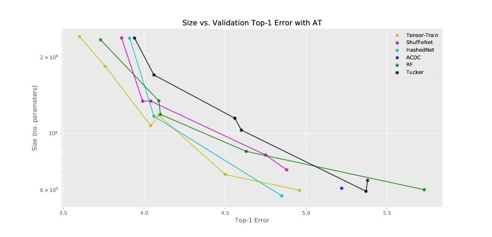
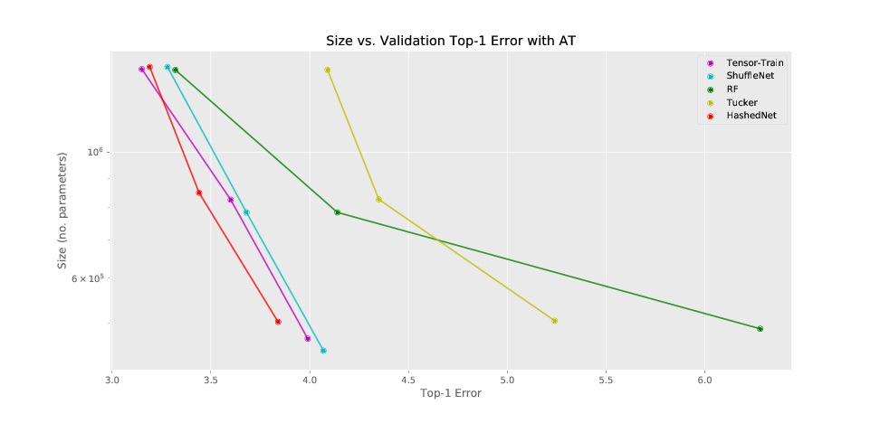
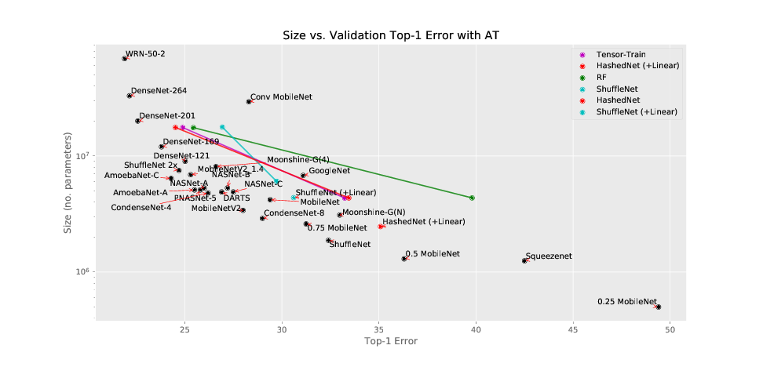

# Deficient Linear Transforms for Efficient Deep Learning

Substitute compressed linear transforms for deep learning. Substitute
convolutions into an existing WideResNet or DARTS network and train as
normal. Details of the research are provided in the [research
log](./research-log.md).

# tl;dr

In a deep neural network, you can replace the matrix multiply with a weight
matrix (a *linear transform*) with an alternative that uses fewer
parameters or mult-adds or both. Such as:

* [HashedNet](./models/hashed.py)
* [Tensor-Train or Tucker decompositions](./models/decomposed.py)
* [A linear ShuffleNet block](https://github.com/BayesWatch/deficient-efficient/blob/master/models/blocks.py#L131-L155)
* [A Sequence of ACDC Layers](https://github.com/gngdb/pytorch-acdc)
* [A Rank Factorized Matrix](https://github.com/BayesWatch/deficient-efficient/blob/master/models/blocks.py#L57-L81).

But, this will only train if you [scale the original weight decay used to
train the network by the compression
ratio](https://github.com/BayesWatch/deficient-efficient/blob/master/models/wide_resnet.py#L49).

## WRN-28-10 on CIFAR-10

## DARTS on CIFAR-10

## WRN-50-2 on ImageNet

## Acknowledgements

Based on: `https://github.com/BayesWatch/pytorch-moonshine`

