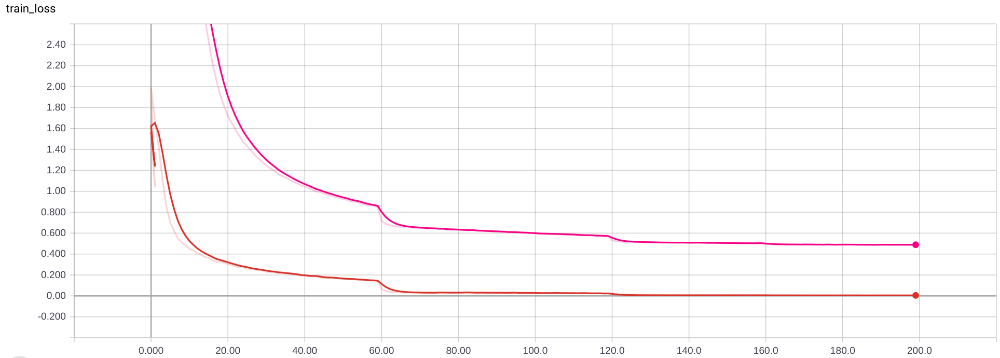
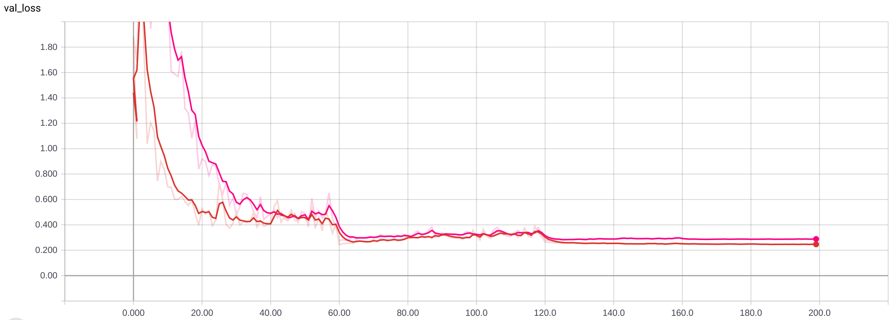
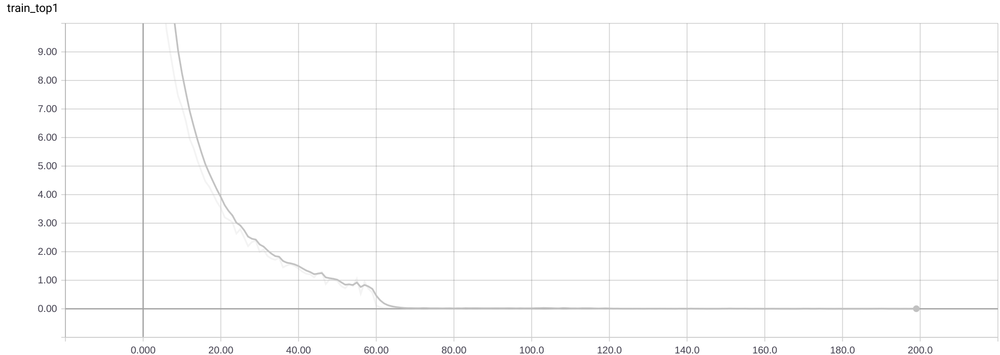
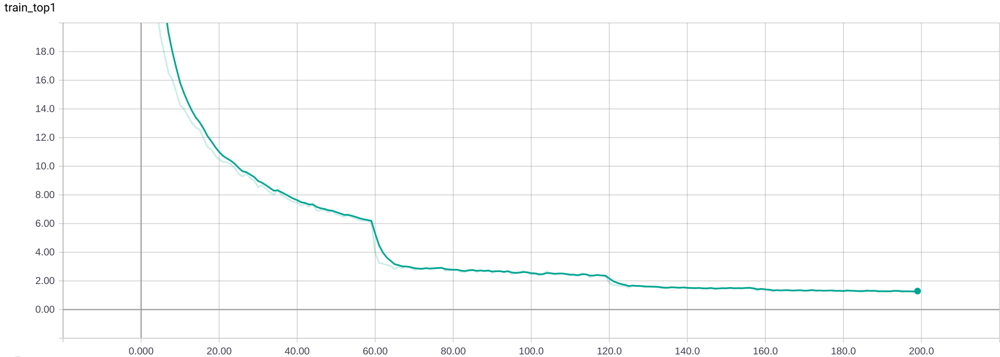

21st November 2018
==================

This research follows on from research done on ACDC transforms and training
networks incorporated them into the convolutional layers, with the goal of
efficiency. That research log is found [here][acdc]

In this repository we're going to be comparing various other methods using
low-rank approximations to the full-rank random matrices typically used in
deep learning. There were some simple tricks that made the training of ACDC
convolutional layers possible:

1. Set an appropriate weight decay.
2. Use distillation.
3. Ensure initialisation maintains the properties of common deep learning
random initialisation strategies.

Currently, we have only added HashedNets to the implemented layers, and
they need to use separable layers (current implementation does not). The
implementation of ACDC layers is separable, so it is required for a level
playing field. Also, it's a standard choice to improve efficiency anyway.

After implementing the current full convolution HashedNet layers, tested
them with a WRN-28-10 and a teacher that achieves 3.3% top 1 error on
CIFAR-10. Strangely, the network trained without a teacher worked better,
achieving a final top-1 error of 6.48%. The student network converged to
7.47%.

The training loss converges to zero in the case of the network trained
without a teacher. Student networks typically don't converge to zero; the
attention transfer loss is hard to minimise.



The overfitting here is not bad, similar to experiments with traditional
networks:



The original network had the following number of parameters and mult-adds:

```
Mult-Adds: 5.24564E+09
Params: 3.64792E+07
```

And we are able to reduce that to be about a 10th, because these HashedNet
layers have been set to use 1/10 the parameters of the original layer.

```
Mult-Adds: 5.24564E+09
Params: 1.49884E+06
```

I'm not sure why the number of parameters even smaller than a 1/10. That
suggests there might be a problem in the script counting parameters.

To check, added a sanity check explicitly checking the number of parameters
in the whole network. Result was the same for both networks, so it could be
that the HashedNet layer's method of choosing how many parameters to budget
for is broken somehow.

Update: found the mistake. Number of original parameters was being
estimated using only one of the kernel dimensions, meaning it was out by,
on average, a factor of three. Fixed it and the network using
HashedDecimate is indeed about 10 times smaller:

```
Mult-Adds: 5.24564E+09
Params: 3.91190E+06
Sanity check, parameters: 3.91190E+06
```

Don't know what performance this network might get, though. Presumably a
little better.

Started an experiment with a SeparableHashedNet, including this fix. So
far, it is performing better, but that could easily be because of the 3x
larger parameter budget in each layer.

[acdc]: https://github.com/gngdb/pytorch-acdc/blob/master/research-log.md

Budget Parameterisation
-----------------------

I wanted to, regardless of the low-rank approximation method chosen, be
able to set a budget in parameters for a network then the code would just
set the hyperparameter controlling how many parameters are used by the
network to meet that. To do that, I need to be able to pass options to the
module implementing the `Conv` that is substituted into the WRN used in
this code.

Currently, the argument given on the command line is just crudely matched
to the name of a `Conv` in `blocks.py`. There's even a horrible `if` block
involved.

Seems like the easiest way to do this is going to be to have a generator
function in `blocks.py` that returns a `Conv` with a hyperparameter set to
whatever we like. Then, it's easy enough to search through a range of
settings when a budget is prescribed.

Wrote it to used scipy's scalar_minimize to set the hyperparameter to match
the budget specified.

DARTS
-----

Would like to run experiments on a state of the art network. DARTS is,
conventiently, one of the best CIFAR-10 networks published, and they
provided a stored model in PyTorch.

22nd November 2018
==================

### DARTS results

Trained a DARTS network with our default training settings overnight. The
final top 1 error was only 4.96%. The accuracy of the pre-trained network
supplied with the paper is below 3%, so their training strategy seems to
also be important. If we're going to use this network in these experiments,
we'll have to port their training script into ours and make sure everything
is the same. This could involve also using the extra augmentations they
use, which could slow down training.

### ACDC results

Also, overnight I ran another experiment with a WRN-28-10 and the original
ACDC parameterisation using a full permutation instead of a riffle shuffle.
The final top 1 error was 5.35%, which is slightly worse than the 5.23%
achieved with the riffle shuffle. Although, they are so similar it seems
likely that how the shuffle is done isn't very important.

### HashedNet results

Trained separable HashedNet WRN-28-10 with and without distillation using
the same teacher used in other experiments. Before, for reference, the
network has `3.64792E+07` parameters, and after it has `3.91190E+06`
parameters, so approximately 10x fewer. Trained without distillation, the
top-1 error is 5.95%, with distillation it decreases to 3.84%: similar to
the results obtained with grouping and bottlenecks described in the
[pytorch-acdc research log][acdc].

### Matching DARTS training protocol

Looking at the code provided for training DARTS models, and trying to make
sure we do exactly the same thing when we train one. Hyperparameters:

* `batch_size = 96`
* `learning_rate = 0.025`
* `momentum = 0.9`
* `weight_decay = 3e-4`
* `epochs = 600` !!!

Data tranforms:

* port `_data_transforms_cifar10` functions from `utils.py` and use it
* will also need to port `Cutout` (succint implementation of Cutout), also
in `utils.py`

Training specifics:

* Cosine annealing learning rate schedule, annealing over the entire
training schedule.
* Linearly schedule `drop_path_prob` in the model object from 0 to 0.2
over the entire training schedule.

Training will probably take about 24 hours, with these changes.

Did some hacky `if` statements to make these changes when running with a
`DARTS` network. Should work.

Started an experiment training the DARTS network with the proposed
settings. Unfortunately, my estimate of 24 hours looks to be optimistic.
The estimate given by the code itself is currently 42 hours. I think the
training code provided in the DARTS repo was a little faster than this.

Started parallel experiment running the original training code from scratch
on a separate GPU. Should be able to compare the learning curves later, if
required.

### Matching Teacher/Student WRN-28-10 Training

Currently, the experiments reported here with WRN-28-10 used a WRN-28-10
that had been trained using Cutout augmentation, but the student hadn't
used this augmentation. I thought it better to use a teacher network that
wasn't trained with Cutout augmentation in order that they match, and then
the results will match the performance of WRN-28-10 reported in the
literature.

I got a pretrained WRN-28-10 from someone else in our group, who tested it
and found it's test error was 3.95%, but after loading it into this code I
tested it at 4.2%. I'm not sure what the source of error might be.

23rd November 2018
==================

Seemed reasonable to use the best reported WRN architecture in our ImageNet
experiments, as that is a reasonable benchmark. Unfortunately, it turns out
the WRN-50-2 reported in the paper, and provided with an esoteric
functional implementation [here][func] is slightly different from the
models trained on CIFAR-10. It doesn't match the figures in the paper on
the structure of the network.

Maybe it's mentioned somewhere in the paper in passing but I didn't see it.
It turns out it's a ResNet-50, but with `expansion=2` and all channels
doubled.

So, I adapted the official ResNet50 implementation from torchvision and
loaded the supplied parameters: implemeneted in the script
`load_wrn_50_2.py`. Luckily, the ordering of parameters matched without too
much difficulty.

Testing this over the validation set:

```
Error@1 22.530 Error@5 6.406
```

Which is unfortunately 0.5% short of the expected top-1/top-5 of 22.0/6.05.
Not sure why that might be, if there had been a problem loading parameters
(if something hadn't matched properly) I would've expected it to fail
completely.

To double check, updated `load_wrn_50_2.py` to run a random input through
both networks and check the output is always the same. The max absolute
error never gets about 1e-3, so they're doing the same thing. The
difference in error may just be because this is an old implementation and
some small thing may have changed in the PyTorch code. The only way to know
for sure would be to run the original validation script and see if the
results still hold.

So, I did that, and the results matched the results got from my own
experiment on the validation set (top-1/top-5): `[77.47, 93.594]`. I can't
explain that 0.5%. Committing the version of the script I ran,
[here](https://gist.github.com/gngdb/c5855e10dea83c99a44b338acc76759f).

[func]: https://github.com/szagoruyko/functional-zoo/blob/master/wide-resnet-50-2-export.ipynb

### Testing ImageNet Training

Before we train a student network, we need to know that our training
routine works for this WRN-50-2 network. Looking at the original paper,
they report the learning rate, weight decay and momentum match what we
already set to do CIFAR-10 training with these WideResNets. Unfortunately,
they don't give more details on the ImageNet training, other than saying
they use `fb.resnet.torch`. That gives no clear single prescription for a
ResNet-50, beyond setting the minibatch size to 256 and using 4 GPUs in
parallel.

As I've trained ImageNet models in the past using PyTorch, I'm just going
to use those settings. Matching the [PyTorch ImageNet
example][imagenetexample]:

* 90 epochs
* learning rate decays every 30 epochs to 1/10 of prior
* batch size 256 (unlikely to fit on 1 GPU)

Only have 1 GPU free right now. Was not able to start an experiment with
batch size 256, or 64. Had to set it to 32. Unfortunately, by my estimate
it will take two weeks and may not even converge properly with the wrong
batch size. Hopefully, this is only because we're not using multi-gpu
training and not a problem with our training script.

**update**: killed this experiment, after a few days it did not appear to
be converging.

[imagenetexample]: https://github.com/pytorch/examples/blob/master/imagenet/main.py

26th November 2018
==================

Talking to Amos, seems like using cutout in all experiments is probably a
safer course of action. Don't want to arbitrarily limit the results.

Started experiment to test chosen AT taps, and distillation in general,
when using a DARTS network. Used Separabled-Hashed-Decimate substitution.

28th November 2018
==================

Tested running student WRN-28-10 with Cutout enabled, as the teacher was
also trained with Cutout. Used the Separable-Hashed-Decimate substitute
convolution layer, as we've already done an experiment with this same
network so we can compare. The results (found above) were previously 3.84%
top-1 error at the end of training. With Cutout, it actually performed
worse, with a top-1 error of 3.99%.

Investigating this, I found something I hadn't previously noticed. The
hashed network layers overfit very heavily without Cutout. The train top-1
of the same Separable-Hashed-Decimate substitute convolution before Cutout
was used in training:



And this is the same when the network is trained without a teacher network.
The weight decay setting for the hashed network real weights is probably
set too low, because we set it simply to be the value used for ACDC
experiments.

However, when Cutout is used, the top-1 error no longer has this issue:



Now, it's underfitting. It never reaches zero top-1 error, despite the
validation top-1 being very similar in both cases. So, maybe in this case
the weight decay setting is OK. If we assume this means that using Cutout
in experiments can make setting the weight decay more robust, then it's
probably better to include it.

Finally, the final validation cross-entropy loss is slightly lower, at
0.1388 versus 0.1401 when using Cutout, so it's probably still better to
use it.

We have plans for setting the weight decay based on the compression factor
of the low-rank approximation. It would be worth running these experiments
now sooner, rather than later.

29th November 2019
==================

Test using a student network in DARTS with a Separable Hashed Decimate
substitution finished today. It took 58 hours total, but at least it only
needs one GPU to run on. Before substitution:

```
> python count.py cifar10 --conv Sep --network DARTS
Mult-Adds: 5.38201E+08
Params: 3.34934E+06
Sanity check, parameters: 3.34934E+06
```

With HashedNet conv blocks substituted, we don't see much reduction in
parameters, because DARTS already uses small separable convolutions, and
the number of parameters used in the "Decimate" layers is calculated based
on a full convolution.

```
> python count.py cifar10 --conv SepHashedDecimate --network DARTS
Mult-Adds: 5.38201E+08
Params: 3.03657E+06
Sanity check, parameters: 3.03657E+06
```

So, we have reduced it only by 10% of the parameters. It would really have
been a good idea to check this before running the experiment, but here we
are. And, we can at least say the student network training works, because
it converged to 2.94% top-1 error, which is still better than most networks
on CIFAR-10. The teacher scored 2.86%, so only a relative difference of
0.02, or 0.08% absolute.

30th November 2018
==================

Looked into better theory on what to set the weight decay to. It's not
possible to use a change of variables in general here, because the low-rank
approximations are all one-to-many. I hoped there might be some
approximation that would give a good guide on how much to reduce the weight
decay factor by, but couldn't find anything.

Matt Graham suggested we might be able to find an appropriate scaling
factor by SGD. I tried this a little in a script called `weight_decay.py`, in commit
`9da1d0afdb73b7019312ac7475e733c1c65dd59e` and removed after. It was very
unstable (the loss function varied by many orders of magnitude depending on
the input). Unsure exactly what is going wrong here, but I've spent enough
time on this. We'll just set the weight decay uniformly low in experiments.

Default Tensor dtype
--------------------

It seems that the `tntorch` import in `decomposed.py` sets all tensors to
initialise with `Double` precision, which breaks everything else. 

It's because this line is in `tntorch.tensor`:
`torch.set_default_dtype(torch.float64)`. I don't particularly want to pull
request a fix for this as well, so I'll just set the default dtype back to
normal after the import.

11th December 2018
==================

Unfortunately, wasn't able to start experiments before NeurIPS. Turns out
it's not so easy to substitute layers into DARTS to save parameters. While
at NeurIPS, I had a spare moment to investigate.

It looks like a fairly large proportion of the parameters in the learnt
DARTS architecture are used in the skip connections. Those employ full
convolutions, while the rest of the network uses depthwise separable
convolutions. I don't know if it's necessary that they do, but it makes the
job of substitution more difficult.

Previously, wherever there was a grouped convolution followed by a
pointwise convolution in the original network structure I would replace
that by whatever alternative low-parameter convolutional block we were
looking at: usually a grouped convolution followed by a low-rank pointwise.
I thought this would be simple enough to work with, and makes some of the
layers easier to design.

The problem with these skip connections is, now I'll be doing a different
substitution. It's a full convolution, and it might be necessary that it be
so for the current performance of the network. So, substituting
modifications using depthwise-separable convolutions is changing the
underlying network.

More practically, it means that we can't load the teacher network so
easily, because it will try to load the parameters for a full convolution
to a place where we've now substituted in a separable convolution. This is
just due to how the code works.

Continuing without substituting the skip connections is not going to work,
because then we can, at best, only reduce the size of the DARTS network by
about half, regardless of which method we use. We'd like to be able to aim
for higher compression factors than that. But, we should find out how much
changing that convolution to separable affects the DARTS network - will it
still achieve the same accuracy?

So, two experiments to start: one where we substitute these layers and
actually reduce the size of the DARTS network by 10 times using a HashedNet
substitution, and another where we train a DARTS network from scratch but
with separable substitutions.

With these changes to the code, the `SepHashedDecimate` substitution
reduces the approximately 3M parameter DARTS network to:

```
Mult-Adds: 5.41629E+08
Params: 4.28400E+05
Sanity check, parameters: 4.28400E+05
```

<<<<<<< HEAD
Started experiments described above, to check that this is a valid change
to make for experiments. Will be finished in 3 days.

Accidentally named the experiment training a DARTS network from scratch
with separable convolutions in the shortcuts with the date tag Nov22
because I forgot to change it. Currently running on tullibardine.

12th December 2018
==================

Coming back to the idea for a justification for setting a lower weight
decay, so that we might be able to figure out what weight decay to set
based on the compression factor that the compressed weight matrix is
achieving, Joe Mellor suggested that we just preserve the total
variance of the prior.

I've written out what this derivation would look like
[here](https://hackmd.io/yU6X1jIfTuqGaCTsjUekFQ).

To check if it makes sense, I'm going to run an experiment we've run before
using HashedNet layers, setting the weight decay according to this. Should
hopefully see a difference.

A good choice might be `wrn_28_10.patch.wrn_28_10.acdc.student.5m4.Nov15`,
which achieved a final test top 1 of 4.95%. This experiment was repeated
the day after, including the grouped convolution as well to use the lower
weight decay factor, but the final test error was worse, achieving only
5.26%. 

Modifying the code to use the compression factor to calculate the appropriate
weight decay.

Running this command for the experiment:

```
python main.py cifar10 student --conv ACDC -t wrn_28_10.patch -s wrn_28_10.acdc.student.Dec11 --wrn_depth 28 --wrn_width 10 --alpha 0. --beta 1e3
```

OOM DARTS and adding checkpointing
---------

After making these changes, a new problem occurs. With these extra
substitutions the computational graph is now much larger, so the model hits
an OOM while trying to do the backward pass. Specifically, it happens when
`drop_path` is enabled, otherwise the model *just* fits (around 11GB)
during training.

To investigate, running with batch size 12 we use 2073MB and then enabling
`drop_path` this increases to 2207MB; around a 6% increase.

I thought perhaps it would be possible to reduce the memory usage using the
new [checkpoint][torchcheckpoint] utility in pytorch, but after wrapping
the function implementing `drop_path`, the memory usage was still 2207MB.

Instead, tried using the checkpoint utility on `torch.cat` calls in the
model. Then, memory use actually increased to 2277MB, which doesn't make
much sense.

Instead, replacing the factorized reduction function with a checkpointed
version reduced memory usage to 2183MB, which is probably not enough.

In addition to that, checkpointing ConvReluBN blocks brought it down to
1803MB. Putting the batch size back to normal, the model runs using 9235MB.
However, it now takes about 750ms per iteration, versus 630ms before (when
not dropping paths). Don't see any way around this though, we do need to be
able to run this model while using more memory.

Now started an experiment with this code and it looks like it'll take
around 66 hours to complete.

[torchcheckpoint]: https://pytorch.org/docs/stable/checkpoint.html

13th December 2018
==================

High Compression with HashedNets
--------------------------------

After thinking that the experiment described on the 11th had completed (it
had not), I ran two experiments to test high compression factors using
HashedNet. One used 1/100 the parameters in each layer that the original
network used, and the other was attempting to meet a budget of 1e5
parameters total, both using `wrn_28_10`.

Looking at the number of parameters used here:

```
> python count.py cifar10 --conv Hashed_0.01 --wrn_depth 28 --wrn_width 10
Mult-Adds: 5.24564E+09
Params: 6.54272E+05
Sanity check, parameters: 6.54272E+05
```

And the budgeted one, we can assume reached close to 1e5 parameters.

Neither performed well. Budgetat at 1e5 parameters, the wide resnet failed
to converge at all, although the training loss didn't become unstable. Both
show significant underfitting.

The final test top-1 error of `Hashed_0.01` was 29.81%, which is a complete
failure, even for that low parameter budget.

It should be noted that the HashedNet implementation now applies the
hashing to both the grouped and pointwise convolutions when substituting,
and this experiment has failed to test whether that significantly affects
training. So, running another experiment using a HashedNet that decimates a
`wrn_28_10`.

More Naming Mistakes
--------------------

When training the DARTS network from scratch, but substituting skip
connections with a separable convolution, I forgot to change the date tag,
so it has the same `darts.Nov22` tag as the original run. This could be a
problem, because it's overwritten the model checkpoint. Luckily, I've
already copied it to other machines, so I have backups. The real loss is
that it's just appended to the original log file, making the graphs harder
to read on TensorBoard.

14th December 2018
==================

DARTS with Separable Shortcuts
------------------------------

Training a DARTS network from scratch, using the same training protocol but
using separable convolutions in the shortcut connections finished training
with 3.16% top-1 error. Originally, it scored 2.86%, so we've lost some
performance.

```
> python count.py cifar10 --network DARTS --conv Sep                          
Mult-Adds: 5.41629E+08
Params: 3.36219E+06
Sanity check, parameters: 3.36219E+06
```

Although, it turns out that I made a mistake in the substitution. I didn't
realise that these skip layers are only ever 1x1 convolutions and the
DepthwiseSep module I used as a substitution *always* added a grouped
convolution (should really have at least added a check to see if a spatial
convolution was required). So, all we did was add extra scaling parameters
in a 1x1 grouped convolution prior to the 1x1 pointwise convolution that
was already there. So, the number of parameters stayed the same actually
increased. Before the substitution this is how many parameters the network
used:

```
Mult-Adds: 5.38201E+08
Params: 3.34934E+06
Sanity check, parameters: 3.34934E+06
```

Strange then that this should so negatively affect the results. But it
does at least make the substitution easier. We may even be able to maintain
full rank grouped convolutions in these experiments.

Also, I fixed the DepthwiseSep layer so that it only uses grouped
convolutions when required. Should really add a test to run over all of the
substitutions modules and make sure this doesn't happen again.

Unfortunately, the experiment distilling the DARTS network down to
approximately 1/10 the size using HashedNet substitutions keeps hitting
SegFaults at random intervals during training. Trying to figure out a
reasonable way to debug this. May just try running it on a different
machine; at least, if that is the problem, our experiments on cloud
providers aren't completely ruined.

WRN, appropriate weight decay
-----------------------------

Started experiments with ACDC and HashedNet substitutions. To recap, the
original, full-rank WRN-28-10 uses the following number of parameters:

```
> python count.py cifar10 --conv Conv --wrn_width 10 --wrn_depth 28
Mult-Adds: 5.24564E+09
Params: 3.64792E+07
Sanity check, parameters: 3.64792E+07
```

With the ACDC substitution:

```
> python count.py cifar10 --conv ACDC --wrn_width 10 --wrn_depth 28
Mult-Adds: 7.99262E+08
Params: 5.55498E+05
Sanity check, parameters: 5.55498E+05
```

And with the HashedNet substitution:

```
> python count.py cifar10 --conv SepHashedDecimate --wrn_width 10 --wrn_depth 28
Mult-Adds: 6.29697E+08
Params: 7.10327E+05
Sanity check, parameters: 7.10327E+05
```

Which is a bit more compression that just 10% of the parameters. This is
because it was changed to be 10% of the equivalent *separable convolution*.

These two networks are very similar sizes and achieve similar performance.
The HashedNet substitution:

```
Error@1 5.040 Error@5 0.100
```

And the ACDC substitution:

```
Error@1 4.990 Error@5 0.150
```

For comparison, the HashedNet result on 22nd November showed better top-1
error, but the network used several times more parameters, `3.91190E+06`
for a top-1 error of 3.84%.

The same network structure with ACDC was tested and the results reported
[here](https://github.com/gngdb/pytorch-acdc/blob/master/research-log.md#15th-november-2018).
Unfortunately, even this isn't directly comparable because I have since
added cutout augmentation to the training protocol in distillation. But, I
think we can safely conclude that this setting for weight decay is no
worse, for the architectures we've already tried. And, the fact that it
reverts to normal weight decay when we apply no compression is neat.

18th December 2018
==================

HashedNet Substitution on DARTS
-------------------------------

The experiment reducing DARTS to less than 10% it's original size using
HashedNet substitutions in both the grouped and pointwise parts of the
separable convolutions has completed. For reference, here is the
report of it's size:

```
> python count.py cifar10 --conv SepHashedDecimate --network DARTS
Mult-Adds: 5.41629E+08
Params: 4.28400E+05
Sanity check, parameters: 4.28400E+05
```

The final top-1 test error was 4.64%.

The learning curves show more underfitting than when training a full-size
DARTS network. The full-size top-1 training error reduces to 1.5%, while
this compressed network finishes at 5%; higher than test error due to
dropout.

Compression ratio is 79, ie the compressed network contains 1.3% the
parameters of the full-size network.

Status
------

The aim is to start running experiments on CIFAR-10 and ImageNet as soon as
possible. What is left to do until that can happen?

1. Run a test with tntorch decomposition, see if it will converge.
2. Test sizes of networks with different settings to see if all compressed
layers can meet the budgets we're interested in.
3. Test ImageNet distillations settings: can we train a WRN-50-2 on
ImageNet with distillation using this code as it currently stands?
4. (Optional) Review code for all layers by eye, to be safe.
5. Set up AWS to run CIFAR-10 experiments and collate results.

tntorch float32
---------------

rballester pushed an update so that the Tucker decomposition can still be
calculated if the default dtype is changed. Just ran the tests again, and
it seems like it works, so don't have to use my hacky solution.

Starting TensorTrain Experiments
--------------------------------

Started experiments running TensorTrain, with a rank scaling factor of 0.1
to check that we can use tntorch; ie that forward and backward propagation
through this parameterisation wouldn't be too slow. For completeness, here
are the commands, and filenames:

```
wrn_28_10.tensortrain_0.1.Dec18.t7:  main.py cifar10 teacher --conv TensorTrain_0.1 -t wrn_28_10.tensortrain_0.1.Dec18 --wrn_width 10 --wrn_depth 28 --alpha 0. --beta 1e3
wrn_28_10.tensortrain_0.1.student.Dec18.t7:  main.py cifar10 student --conv TensorTrain_0.1 -t wrn_28_10.patch -s wrn_28_10.tensortrain_0.1.student.Dec18 --wrn_depth 28 --wrn_width 10 --alpha 0. --beta 1e3
```

Starting Tucker and CP Experiments
----------------------------------

Had two free GPUs to work with, so started experiments training these
networks from scratch with the same rank scaling settings as the
TensorTrain experiment. Should be useful for comparison, and to discover
any problems with training these networks.

```

wrn_28_10.tucker_0.1.Dec18.t7:  main.py cifar10 teacher --conv Tucker_0.1 -t wrn_28_10.tucker_0.1.Dec18 --wrn_width 10 --wrn_depth 28 --alpha 0. --beta 1e3
wrn_28_10.cp_0.1.Dec18.t7:  main.py cifar10 teacher --conv CP_0.1 -t wrn_28_10.cp_0.1.Dec18 --wrn_width 10 --wrn_depth 28 --alpha 0. --beta 1e3
```
=======
Keep getting segfaults training the SepHashedDecimate DARTS network, but
only after many epochs of training. Not sure exactly what's happening here,
but this could cause big problems training networks on AWS. Restarted
experiment, will likely take until Saturday now, barring more segfaults.
