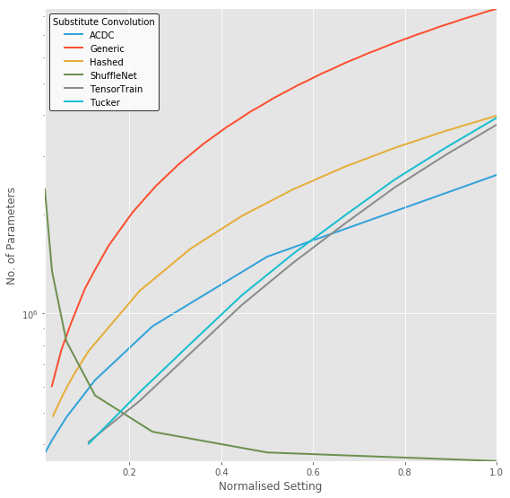
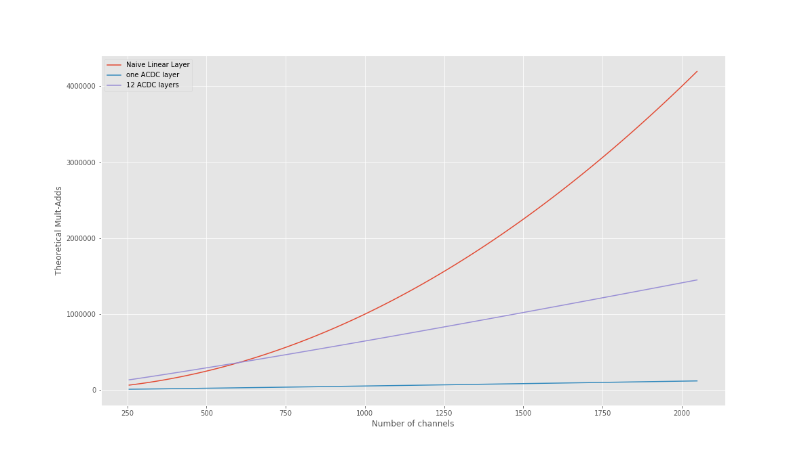

21st November 2018
==================

This research follows on from research done on ACDC transforms and training
networks incorporated them into the convolutional layers, with the goal of
efficiency. That research log is found [here][acdc]

In this repository we're going to be comparing various other methods using
low-rank approximations to the full-rank random matrices typically used in
deep learning. There were some simple tricks that made the training of ACDC
convolutional layers possible:

1. Set an appropriate weight decay.
2. Use distillation.
3. Ensure initialisation maintains the properties of common deep learning
random initialisation strategies.

Currently, we have only added HashedNets to the implemented layers, and
they need to use separable layers (current implementation does not). The
implementation of ACDC layers is separable, so it is required for a level
playing field. Also, it's a standard choice to improve efficiency anyway.

After implementing the current full convolution HashedNet layers, tested
them with a WRN-28-10 and a teacher that achieves 3.3% top 1 error on
CIFAR-10. Strangely, the network trained without a teacher worked better,
achieving a final top-1 error of 6.48%. The student network converged to
7.47%.

The training loss converges to zero in the case of the network trained
without a teacher. Student networks typically don't converge to zero; the
attention transfer loss is hard to minimise.


The overfitting here is not bad, similar to experiments with traditional
networks:


The original network had the following number of parameters and mult-adds:

```
Mult-Adds: 5.24564E+09
Params: 3.64792E+07
```

And we are able to reduce that to be about a 10th, because these HashedNet
layers have been set to use 1/10 the parameters of the original layer.

```
Mult-Adds: 5.24564E+09
Params: 1.49884E+06
```

I'm not sure why the number of parameters even smaller than a 1/10. That
suggests there might be a problem in the script counting parameters.

To check, added a sanity check explicitly checking the number of parameters
in the whole network. Result was the same for both networks, so it could be
that the HashedNet layer's method of choosing how many parameters to budget
for is broken somehow.

Update: found the mistake. Number of original parameters was being
estimated using only one of the kernel dimensions, meaning it was out by,
on average, a factor of three. Fixed it and the network using
HashedDecimate is indeed about 10 times smaller:

```
Mult-Adds: 5.24564E+09
Params: 3.91190E+06
Sanity check, parameters: 3.91190E+06
```

Don't know what performance this network might get, though. Presumably a
little better.

Started an experiment with a SeparableHashedNet, including this fix. So
far, it is performing better, but that could easily be because of the 3x
larger parameter budget in each layer.

[acdc]: https://github.com/gngdb/pytorch-acdc/blob/master/research-log.md

Budget Parameterisation
-----------------------

I wanted to, regardless of the low-rank approximation method chosen, be
able to set a budget in parameters for a network then the code would just
set the hyperparameter controlling how many parameters are used by the
network to meet that. To do that, I need to be able to pass options to the
module implementing the `Conv` that is substituted into the WRN used in
this code.

Currently, the argument given on the command line is just crudely matched
to the name of a `Conv` in `blocks.py`. There's even a horrible `if` block
involved.

Seems like the easiest way to do this is going to be to have a generator
function in `blocks.py` that returns a `Conv` with a hyperparameter set to
whatever we like. Then, it's easy enough to search through a range of
settings when a budget is prescribed.

Wrote it to used scipy's scalar_minimize to set the hyperparameter to match
the budget specified.

DARTS
-----

Would like to run experiments on a state of the art network. DARTS is,
conventiently, one of the best CIFAR-10 networks published, and they
provided a stored model in PyTorch.

22nd November 2018
==================

### DARTS results

Trained a DARTS network with our default training settings overnight. The
final top 1 error was only 4.96%. The accuracy of the pre-trained network
supplied with the paper is below 3%, so their training strategy seems to
also be important. If we're going to use this network in these experiments,
we'll have to port their training script into ours and make sure everything
is the same. This could involve also using the extra augmentations they
use, which could slow down training.

### ACDC results

Also, overnight I ran another experiment with a WRN-28-10 and the original
ACDC parameterisation using a full permutation instead of a riffle shuffle.
The final top 1 error was 5.35%, which is slightly worse than the 5.23%
achieved with the riffle shuffle. Although, they are so similar it seems
likely that how the shuffle is done isn't very important.

### HashedNet results

Trained separable HashedNet WRN-28-10 with and without distillation using
the same teacher used in other experiments. Before, for reference, the
network has `3.64792E+07` parameters, and after it has `3.91190E+06`
parameters, so approximately 10x fewer. Trained without distillation, the
top-1 error is 5.95%, with distillation it decreases to 3.84%: similar to
the results obtained with grouping and bottlenecks described in the
[pytorch-acdc research log][acdc].

### Matching DARTS training protocol

Looking at the code provided for training DARTS models, and trying to make
sure we do exactly the same thing when we train one. Hyperparameters:

* `batch_size = 96`
* `learning_rate = 0.025`
* `momentum = 0.9`
* `weight_decay = 3e-4`
* `epochs = 600` !!!

Data tranforms:

* port `_data_transforms_cifar10` functions from `utils.py` and use it
* will also need to port `Cutout` (succint implementation of Cutout), also
in `utils.py`

Training specifics:

* Cosine annealing learning rate schedule, annealing over the entire
training schedule.
* Linearly schedule `drop_path_prob` in the model object from 0 to 0.2
over the entire training schedule.

Training will probably take about 24 hours, with these changes.

Did some hacky `if` statements to make these changes when running with a
`DARTS` network. Should work.

Started an experiment training the DARTS network with the proposed
settings. Unfortunately, my estimate of 24 hours looks to be optimistic.
The estimate given by the code itself is currently 42 hours. I think the
training code provided in the DARTS repo was a little faster than this.

Started parallel experiment running the original training code from scratch
on a separate GPU. Should be able to compare the learning curves later, if
required.

### Matching Teacher/Student WRN-28-10 Training

Currently, the experiments reported here with WRN-28-10 used a WRN-28-10
that had been trained using Cutout augmentation, but the student hadn't
used this augmentation. I thought it better to use a teacher network that
wasn't trained with Cutout augmentation in order that they match, and then
the results will match the performance of WRN-28-10 reported in the
literature.

I got a pretrained WRN-28-10 from someone else in our group, who tested it
and found it's test error was 3.95%, but after loading it into this code I
tested it at 4.2%. I'm not sure what the source of error might be.

23rd November 2018
==================

Seemed reasonable to use the best reported WRN architecture in our ImageNet
experiments, as that is a reasonable benchmark. Unfortunately, it turns out
the WRN-50-2 reported in the paper, and provided with an esoteric
functional implementation [here][func] is slightly different from the
models trained on CIFAR-10. It doesn't match the figures in the paper on
the structure of the network.

Maybe it's mentioned somewhere in the paper in passing but I didn't see it.
It turns out it's a ResNet-50, but with `expansion=2` and all channels
doubled.

So, I adapted the official ResNet50 implementation from torchvision and
loaded the supplied parameters: implemeneted in the script
`load_wrn_50_2.py`. Luckily, the ordering of parameters matched without too
much difficulty.

Testing this over the validation set:

```
Error@1 22.530 Error@5 6.406
```

Which is unfortunately 0.5% short of the expected top-1/top-5 of 22.0/6.05.
Not sure why that might be, if there had been a problem loading parameters
(if something hadn't matched properly) I would've expected it to fail
completely.

To double check, updated `load_wrn_50_2.py` to run a random input through
both networks and check the output is always the same. The max absolute
error never gets about 1e-3, so they're doing the same thing. The
difference in error may just be because this is an old implementation and
some small thing may have changed in the PyTorch code. The only way to know
for sure would be to run the original validation script and see if the
results still hold.

So, I did that, and the results matched the results got from my own
experiment on the validation set (top-1/top-5): `[77.47, 93.594]`. I can't
explain that 0.5%. Committing the version of the script I ran,
[here](https://gist.github.com/gngdb/c5855e10dea83c99a44b338acc76759f).

[func]: https://github.com/szagoruyko/functional-zoo/blob/master/wide-resnet-50-2-export.ipynb

### Testing ImageNet Training

Before we train a student network, we need to know that our training
routine works for this WRN-50-2 network. Looking at the original paper,
they report the learning rate, weight decay and momentum match what we
already set to do CIFAR-10 training with these WideResNets. Unfortunately,
they don't give more details on the ImageNet training, other than saying
they use `fb.resnet.torch`. That gives no clear single prescription for a
ResNet-50, beyond setting the minibatch size to 256 and using 4 GPUs in
parallel.

As I've trained ImageNet models in the past using PyTorch, I'm just going
to use those settings. Matching the [PyTorch ImageNet
example][imagenetexample]:

* 90 epochs
* learning rate decays every 30 epochs to 1/10 of prior
* batch size 256 (unlikely to fit on 1 GPU)

Only have 1 GPU free right now. Was not able to start an experiment with
batch size 256, or 64. Had to set it to 32. Unfortunately, by my estimate
it will take two weeks and may not even converge properly with the wrong
batch size. Hopefully, this is only because we're not using multi-gpu
training and not a problem with our training script.

**update**: killed this experiment, after a few days it did not appear to
be converging.

[imagenetexample]: https://github.com/pytorch/examples/blob/master/imagenet/main.py

26th November 2018
==================

Talking to Amos, seems like using cutout in all experiments is probably a
safer course of action. Don't want to arbitrarily limit the results.

Started experiment to test chosen AT taps, and distillation in general,
when using a DARTS network. Used Separabled-Hashed-Decimate substitution.

28th November 2018
==================

Tested running student WRN-28-10 with Cutout enabled, as the teacher was
also trained with Cutout. Used the Separable-Hashed-Decimate substitute
convolution layer, as we've already done an experiment with this same
network so we can compare. The results (found above) were previously 3.84%
top-1 error at the end of training. With Cutout, it actually performed
worse, with a top-1 error of 3.99%.

Investigating this, I found something I hadn't previously noticed. The
hashed network layers overfit very heavily without Cutout. The train top-1
of the same Separable-Hashed-Decimate substitute convolution before Cutout
was used in training:


And this is the same when the network is trained without a teacher network.
The weight decay setting for the hashed network real weights is probably
set too low, because we set it simply to be the value used for ACDC
experiments.

However, when Cutout is used, the top-1 error no longer has this issue:


Now, it's underfitting. It never reaches zero top-1 error, despite the
validation top-1 being very similar in both cases. So, maybe in this case
the weight decay setting is OK. If we assume this means that using Cutout
in experiments can make setting the weight decay more robust, then it's
probably better to include it.

Finally, the final validation cross-entropy loss is slightly lower, at
0.1388 versus 0.1401 when using Cutout, so it's probably still better to
use it.

We have plans for setting the weight decay based on the compression factor
of the low-rank approximation. It would be worth running these experiments
now sooner, rather than later.

29th November 2019
==================

Test using a student network in DARTS with a Separable Hashed Decimate
substitution finished today. It took 58 hours total, but at least it only
needs one GPU to run on. Before substitution:

```
> python count.py cifar10 --conv Sep --network DARTS
Mult-Adds: 5.38201E+08
Params: 3.34934E+06
Sanity check, parameters: 3.34934E+06
```

With HashedNet conv blocks substituted, we don't see much reduction in
parameters, because DARTS already uses small separable convolutions, and
the number of parameters used in the "Decimate" layers is calculated based
on a full convolution.

```
> python count.py cifar10 --conv SepHashedDecimate --network DARTS
Mult-Adds: 5.38201E+08
Params: 3.03657E+06
Sanity check, parameters: 3.03657E+06
```

So, we have reduced it only by 10% of the parameters. It would really have
been a good idea to check this before running the experiment, but here we
are. And, we can at least say the student network training works, because
it converged to 2.94% top-1 error, which is still better than most networks
on CIFAR-10. The teacher scored 2.86%, so only a relative difference of
0.02, or 0.08% absolute.

30th November 2018
==================

Looked into better theory on what to set the weight decay to. It's not
possible to use a change of variables in general here, because the low-rank
approximations are all one-to-many. I hoped there might be some
approximation that would give a good guide on how much to reduce the weight
decay factor by, but couldn't find anything.

Matt Graham suggested we might be able to find an appropriate scaling
factor by SGD. I tried this a little in a script called `weight_decay.py`, in commit
`9da1d0afdb73b7019312ac7475e733c1c65dd59e` and removed after. It was very
unstable (the loss function varied by many orders of magnitude depending on
the input). Unsure exactly what is going wrong here, but I've spent enough
time on this. We'll just set the weight decay uniformly low in experiments.

Default Tensor dtype
--------------------

It seems that the `tntorch` import in `decomposed.py` sets all tensors to
initialise with `Double` precision, which breaks everything else. 

It's because this line is in `tntorch.tensor`:
`torch.set_default_dtype(torch.float64)`. I don't particularly want to pull
request a fix for this as well, so I'll just set the default dtype back to
normal after the import.

11th December 2018
==================

Unfortunately, wasn't able to start experiments before NeurIPS. Turns out
it's not so easy to substitute layers into DARTS to save parameters. While
at NeurIPS, I had a spare moment to investigate.

It looks like a fairly large proportion of the parameters in the learnt
DARTS architecture are used in the skip connections. Those employ full
convolutions, while the rest of the network uses depthwise separable
convolutions. I don't know if it's necessary that they do, but it makes the
job of substitution more difficult.

Previously, wherever there was a grouped convolution followed by a
pointwise convolution in the original network structure I would replace
that by whatever alternative low-parameter convolutional block we were
looking at: usually a grouped convolution followed by a low-rank pointwise.
I thought this would be simple enough to work with, and makes some of the
layers easier to design.

The problem with these skip connections is, now I'll be doing a different
substitution. It's a full convolution, and it might be necessary that it be
so for the current performance of the network. So, substituting
modifications using depthwise-separable convolutions is changing the
underlying network.

More practically, it means that we can't load the teacher network so
easily, because it will try to load the parameters for a full convolution
to a place where we've now substituted in a separable convolution. This is
just due to how the code works.

Continuing without substituting the skip connections is not going to work,
because then we can, at best, only reduce the size of the DARTS network by
about half, regardless of which method we use. We'd like to be able to aim
for higher compression factors than that. But, we should find out how much
changing that convolution to separable affects the DARTS network - will it
still achieve the same accuracy?

So, two experiments to start: one where we substitute these layers and
actually reduce the size of the DARTS network by 10 times using a HashedNet
substitution, and another where we train a DARTS network from scratch but
with separable substitutions.

With these changes to the code, the `SepHashedDecimate` substitution
reduces the approximately 3M parameter DARTS network to:

```
Mult-Adds: 5.41629E+08
Params: 4.28400E+05
Sanity check, parameters: 4.28400E+05
```

Started experiments described above, to check that this is a valid change
to make for experiments. Will be finished in 3 days.

Accidentally named the experiment training a DARTS network from scratch
with separable convolutions in the shortcuts with the date tag Nov22
because I forgot to change it. Currently running on tullibardine.

12th December 2018
==================

Coming back to the idea for a justification for setting a lower weight
decay, so that we might be able to figure out what weight decay to set
based on the compression factor that the compressed weight matrix is
achieving, Joe Mellor suggested that we just preserve the total
variance of the prior.

I've written out what this derivation would look like
[here](https://hackmd.io/yU6X1jIfTuqGaCTsjUekFQ).

To check if it makes sense, I'm going to run an experiment we've run before
using HashedNet layers, setting the weight decay according to this. Should
hopefully see a difference.

A good choice might be `wrn_28_10.patch.wrn_28_10.acdc.student.5m4.Nov15`,
which achieved a final test top 1 of 4.95%. This experiment was repeated
the day after, including the grouped convolution as well to use the lower
weight decay factor, but the final test error was worse, achieving only
5.26%. 

Modifying the code to use the compression factor to calculate the appropriate
weight decay.

Running this command for the experiment:

```
python main.py cifar10 student --conv ACDC -t wrn_28_10.patch -s wrn_28_10.acdc.student.Dec11 --wrn_depth 28 --wrn_width 10 --alpha 0. --beta 1e3
```

OOM DARTS and adding checkpointing
---------

After making these changes, a new problem occurs. With these extra
substitutions the computational graph is now much larger, so the model hits
an OOM while trying to do the backward pass. Specifically, it happens when
`drop_path` is enabled, otherwise the model *just* fits (around 11GB)
during training.

To investigate, running with batch size 12 we use 2073MB and then enabling
`drop_path` this increases to 2207MB; around a 6% increase.

I thought perhaps it would be possible to reduce the memory usage using the
new [checkpoint][torchcheckpoint] utility in pytorch, but after wrapping
the function implementing `drop_path`, the memory usage was still 2207MB.

Instead, tried using the checkpoint utility on `torch.cat` calls in the
model. Then, memory use actually increased to 2277MB, which doesn't make
much sense.

Instead, replacing the factorized reduction function with a checkpointed
version reduced memory usage to 2183MB, which is probably not enough.

In addition to that, checkpointing ConvReluBN blocks brought it down to
1803MB. Putting the batch size back to normal, the model runs using 9235MB.
However, it now takes about 750ms per iteration, versus 630ms before (when
not dropping paths). Don't see any way around this though, we do need to be
able to run this model while using more memory.

Now started an experiment with this code and it looks like it'll take
around 66 hours to complete.

[torchcheckpoint]: https://pytorch.org/docs/stable/checkpoint.html

13th December 2018
==================

High Compression with HashedNets
--------------------------------

After thinking that the experiment described on the 11th had completed (it
had not), I ran two experiments to test high compression factors using
HashedNet. One used 1/100 the parameters in each layer that the original
network used, and the other was attempting to meet a budget of 1e5
parameters total, both using `wrn_28_10`.

Looking at the number of parameters used here:

```
> python count.py cifar10 --conv Hashed_0.01 --wrn_depth 28 --wrn_width 10
Mult-Adds: 5.24564E+09
Params: 6.54272E+05
Sanity check, parameters: 6.54272E+05
```

And the budgeted one, we can assume reached close to 1e5 parameters.

Neither performed well. Budgetat at 1e5 parameters, the wide resnet failed
to converge at all, although the training loss didn't become unstable. Both
show significant underfitting.

The final test top-1 error of `Hashed_0.01` was 29.81%, which is a complete
failure, even for that low parameter budget.

It should be noted that the HashedNet implementation now applies the
hashing to both the grouped and pointwise convolutions when substituting,
and this experiment has failed to test whether that significantly affects
training. So, running another experiment using a HashedNet that decimates a
`wrn_28_10`.

More Naming Mistakes
--------------------

When training the DARTS network from scratch, but substituting skip
connections with a separable convolution, I forgot to change the date tag,
so it has the same `darts.Nov22` tag as the original run. This could be a
problem, because it's overwritten the model checkpoint. Luckily, I've
already copied it to other machines, so I have backups. The real loss is
that it's just appended to the original log file, making the graphs harder
to read on TensorBoard.

14th December 2018
==================

DARTS with Separable Shortcuts
------------------------------

Training a DARTS network from scratch, using the same training protocol but
using separable convolutions in the shortcut connections finished training
with 3.16% top-1 error. Originally, it scored 2.86%, so we've lost some
performance.

```
> python count.py cifar10 --network DARTS --conv Sep                          
Mult-Adds: 5.41629E+08
Params: 3.36219E+06
Sanity check, parameters: 3.36219E+06
```

Although, it turns out that I made a mistake in the substitution. I didn't
realise that these skip layers are only ever 1x1 convolutions and the
DepthwiseSep module I used as a substitution *always* added a grouped
convolution (should really have at least added a check to see if a spatial
convolution was required). So, all we did was add extra scaling parameters
in a 1x1 grouped convolution prior to the 1x1 pointwise convolution that
was already there. So, the number of parameters stayed the same actually
increased. Before the substitution this is how many parameters the network
used:

```
Mult-Adds: 5.38201E+08
Params: 3.34934E+06
Sanity check, parameters: 3.34934E+06
```

Strange then that this should so negatively affect the results. But it
does at least make the substitution easier. We may even be able to maintain
full rank grouped convolutions in these experiments.

Also, I fixed the DepthwiseSep layer so that it only uses grouped
convolutions when required. Should really add a test to run over all of the
substitutions modules and make sure this doesn't happen again.

Unfortunately, the experiment distilling the DARTS network down to
approximately 1/10 the size using HashedNet substitutions keeps hitting
SegFaults at random intervals during training. Trying to figure out a
reasonable way to debug this. May just try running it on a different
machine; at least, if that is the problem, our experiments on cloud
providers aren't completely ruined.

WRN, appropriate weight decay
-----------------------------

Started experiments with ACDC and HashedNet substitutions. To recap, the
original, full-rank WRN-28-10 uses the following number of parameters:

```
> python count.py cifar10 --conv Conv --wrn_width 10 --wrn_depth 28
Mult-Adds: 5.24564E+09
Params: 3.64792E+07
Sanity check, parameters: 3.64792E+07
```

With the ACDC substitution:

```
> python count.py cifar10 --conv ACDC --wrn_width 10 --wrn_depth 28
Mult-Adds: 7.99262E+08
Params: 5.55498E+05
Sanity check, parameters: 5.55498E+05
```

And with the HashedNet substitution:

```
> python count.py cifar10 --conv SepHashedDecimate --wrn_width 10 --wrn_depth 28
Mult-Adds: 6.29697E+08
Params: 7.10327E+05
Sanity check, parameters: 7.10327E+05
```

Which is a bit more compression that just 10% of the parameters. This is
because it was changed to be 10% of the equivalent *separable convolution*.

These two networks are very similar sizes and achieve similar performance.
The HashedNet substitution:

```
Error@1 5.040 Error@5 0.100
```

And the ACDC substitution:

```
Error@1 4.990 Error@5 0.150
```

For comparison, the HashedNet result on 22nd November showed better top-1
error, but the network used several times more parameters, `3.91190E+06`
for a top-1 error of 3.84%.

The same network structure with ACDC was tested and the results reported
[here](https://github.com/gngdb/pytorch-acdc/blob/master/research-log.md#15th-november-2018).
Unfortunately, even this isn't directly comparable because I have since
added cutout augmentation to the training protocol in distillation. But, I
think we can safely conclude that this setting for weight decay is no
worse, for the architectures we've already tried. And, the fact that it
reverts to normal weight decay when we apply no compression is neat.

18th December 2018
==================

HashedNet Substitution on DARTS
-------------------------------

The experiment reducing DARTS to less than 10% it's original size using
HashedNet substitutions in both the grouped and pointwise parts of the
separable convolutions has completed. For reference, here is the
report of it's size:

```
> python count.py cifar10 --conv SepHashedDecimate --network DARTS
Mult-Adds: 5.41629E+08
Params: 4.28400E+05
Sanity check, parameters: 4.28400E+05
```

The final top-1 test error was 4.64%.

The learning curves show more underfitting than when training a full-size
DARTS network. The full-size top-1 training error reduces to 1.5%, while
this compressed network finishes at 5%; higher than test error due to
dropout.

Compression ratio is 79, ie the compressed network contains 1.3% the
parameters of the full-size network.

Status
------

The aim is to start running experiments on CIFAR-10 and ImageNet as soon as
possible. What is left to do until that can happen?

1. Run a test with tntorch decomposition, see if it will converge.
2. Test sizes of networks with different settings to see if all compressed
layers can meet the budgets we're interested in.
3. Test ImageNet distillations settings: can we train a WRN-50-2 on
ImageNet with distillation using this code as it currently stands?
4. (Optional) Review code for all layers by eye, to be safe.
5. Set up AWS to run CIFAR-10 experiments and collate results.

tntorch float32
---------------

rballester pushed an update so that the Tucker decomposition can still be
calculated if the default dtype is changed. Just ran the tests again, and
it seems like it works, so don't have to use my hacky solution.

Starting TensorTrain Experiments
--------------------------------

Started experiments running TensorTrain, with a rank scaling factor of 0.1
to check that we can use tntorch; ie that forward and backward propagation
through this parameterisation wouldn't be too slow. For completeness, here
are the commands, and filenames:

```
wrn_28_10.tensortrain_0.1.Dec18.t7:  main.py cifar10 teacher --conv TensorTrain_0.1 -t wrn_28_10.tensortrain_0.1.Dec18 --wrn_width 10 --wrn_depth 28 --alpha 0. --beta 1e3
wrn_28_10.tensortrain_0.1.student.Dec18.t7:  main.py cifar10 student --conv TensorTrain_0.1 -t wrn_28_10.patch -s wrn_28_10.tensortrain_0.1.student.Dec18 --wrn_depth 28 --wrn_width 10 --alpha 0. --beta 1e3
```

Starting Tucker and CP Experiments
----------------------------------

Had two free GPUs to work with, so started experiments training these
networks from scratch with the same rank scaling settings as the
TensorTrain experiment. Should be useful for comparison, and to discover
any problems with training these networks.

```

wrn_28_10.tucker_0.1.Dec18.t7:  main.py cifar10 teacher --conv Tucker_0.1 -t wrn_28_10.tucker_0.1.Dec18 --wrn_width 10 --wrn_depth 28 --alpha 0. --beta 1e3
wrn_28_10.cp_0.1.Dec18.t7:  main.py cifar10 teacher --conv CP_0.1 -t wrn_28_10.cp_0.1.Dec18 --wrn_width 10 --wrn_depth 28 --alpha 0. --beta 1e3
```

19th December 2018
==================

Completed: decomposed.py Experiments
------------------------------------

The experiments described yesterday have finished. Looking at the learning
curves, the weight decay appears to be well-tuned; there's not much
evidence of overfitting. Train top-1 tracks the test top-1 relatively
closely. Results training from scratch:

|               | Train top-1 | Test top-1 |
|---------------|-------------|------------|
|TensorTrain_0.1 | 5.61%      | 8.02%      |
|Tucker_0.1     | 13.7%       | 14.0%      |
|CP_0.1         | 5.81%       | 8.13%      |

The learning curves for the CP and TensorTrain models track very closely.
It could be that, with these settings, they're equivalent fit on random
matrices (I should really look at the maths more closely).

With AT, using the same WRN-28-10 teacher used everywhere in the
experiments reported here, we only have results for TensorTrain. It seems
to help, and it converges to 4.57% top-1 test error.

Now, despite setting the arbitrary rank scaling factor to 0.1 in all of
these cases, these models *don't use the same number of parameters*. But,
`count.py` needs some work right now to estimate how my mult-add operations
would be required, in theory, to run these layers in a real network. Until
then, we can report how many parameters each of these uses:

* `TensorTrain_0.1` : 1.19e6
* `Tucker_0.1` : 1.28e6
* `CP_0.1` : 1.19e6

It's a little surprising to find that the Tucker decomposition is using
more parameters. I was expecting it to be too compressed, to explain why
it's failing to train, but I suppose there must be something else about the
parameterisation that isn't amenable to SGD.

These results do raise a problem with the experiments though. There are
other settings with how we use these decompositions. I've arbitrarily set
the `rank` setting to make it easy to use, but there's much more control
about the type of tensor decomposition we might like to build that may make
a huge difference, like how many cores to use, and their respective ranks
in TensorTrain. `tntorch` appears to make this relatively easy to modify.

I don't really have the knowledge to know what might make a "good" tensor
decomposition for this problem (and I'm not sure who would, since the
problem is to make a tensor decomposition that is more amenable to SGD in a
deep network).

It doesn't seem fair to arbitrarily set these settings for each of these
decompositions. We could do some black box search to find "good" settings
for each, and then use that in all experiments, but that could be very time
consuming (and would delay starting the main set of experiments).

For now, these settings do appear to be sane, and are training. I'll
discuss whether to run extra experiments with someone else.

Talked to Amos
--------------

Amos was of the opinion that this review/comparison of methods must be
systematic. And so, it is necessary that we configure the substitute
decompositions to the best of our ability.

20th December 2018
==================

How many Mult-Adds to Tensor-Train Operations Use?
--------------------------------------------------

While trying to figure out how I should estimate the number of operations
used by a Tensor-Train approximation, have run into a lot of difficulties
understanding exactly how it ought to be implemented. Notes on this can be
found [here](https://hackmd.io/r-0J8c7MRfKPkadv8WEreg).

My conclusion right now is that I can't count on a direct speedup when
substituting *some* of the layers of a convolutional network to a
Tensor-Train format, because then the activations throughout the network
must also be represented as a Tensor-Train approximation, and there are
other concerns about the rank, rounding and approximations that would have
to be considered. I *think*. It may be worth contacting someone with a more
detailed understanding of it.

Ultimate Tensorization
----------------------

Went over this paper again, and it provides some more justification for
going the route of separable convolutions in this investigation. The
Tensor-Train format to use in a convolutional layer is defined differently
to a Naive decomposition of the kernel tensor, and this is necessary for
performance. Luckily, with a pointwise convolution, it's the same
decomposition of the weight matrix of the linear layer from "Tensorizing
Neural Networks".

Although, it does motivate me to rethink exactly how we define the
decomposition. It may be worth reshaping the weight tensor in the
definition. That seems to be an important part of the Tensor decomposition.
Although, I don't know what effect this will have on the performance of
these as weight matrices in neural networks, so we may just have to
investigate by experiment.

The same experiment may be necessary for the Tucker decomposition as well.

Keep getting segfaults training the SepHashedDecimate DARTS network, but
only after many epochs of training. Not sure exactly what's happening here,
but this could cause big problems training networks on AWS. Restarted
experiment, will likely take until Saturday now, barring more segfaults.

Lower Bound Tensor-Train
------------------------

What if I just ignore the operations used in mapping to and from a TT
representation. Using the cores, I can guess the shape the X-tensor would
have if I were to do that, and calculate the number of operations required
to implement said layer. I'll just print a warning that this is a lower
bound in `count.py`.

28th December 2018
==================

Tensor-Train Settings
---------------------

To investigate what "good" settings might be when using tensor-train
subsitutions, ran 196 cifar-10 experiments to see with differents settings
for the rank used in the substitution, and the number of dimensions.
Results are in [this
notebook](https://gist.github.com/gngdb/2d29e5afbb21869e24952284cc287388).

Seems like a larger number of dimensions than two could help (so far
haven't been setting that correctly). Unfortunately, this doesn't give me
much insight as to what settings to use in Tucker or CP-decomposition.

It looks like setting the number of dimensions to between 4 and 6 could be
a good tradeoff, but the results aren't entirely clear. It could be worth
running a longer experiment with only a few networks, with the dimension
set to 4 or 6 and compare to results from before.

ShuffleNet
----------

Added code to control ShuffleNet settings, and since there were GPUs free,
started some experimenets with wide ResNets setting different settings. The
variable is controlling the number of shuffle groups used, with some wiggle
room to set different shuffle group settings where the number of groups
would not divide the number of output channels.

Started experiments with the number of groups set to 4, 8, 16 and 32. Below
are parameter and mult-add counts:

```
> python count.py cifar10 --wrn_width 10 --wrn_depth 28 --conv Shuffle_4
Mult-Adds: 1.17201E+08
Params: 8.23674E+05
```
```
> python count.py cifar10 --wrn_width 10 --wrn_depth 28 --conv Shuffle_8
Mult-Adds: 7.69784E+07
Params: 5.63594E+05
```

```
> python count.py cifar10 --wrn_width 10 --wrn_depth 28 --conv Shuffle_16
Mult-Adds: 6.07583E+07
Params: 4.37354E+05
```

```
> python count.py cifar10 --wrn_width 10 --wrn_depth 28 --conv Shuffle_32
Mult-Adds: 5.12965E+07
Params: 3.78314E+05
```

29th December 2018
==================

Linear ShuffleNet Initial Results
---------------------------------

Metrics after full 200 epoch training schedule:

| No. Shuffle Groups | No. Parameters | No. Mult-Adds | Train Top-1 | Test Top-1 |
|--------------------|----------------|---------------|-------------|------------|
| 4                  | 8.24e5         | 1.17e8        | 2.557%      | 4.758% |
| 8                  | 5.64e5         | 7.7e7        | 3.742%      | 5.979% |
| 16                 | 4.37e5         | 6.07e7        | 5.822%      | 7.7% |
| 32                 | 3.78e5         | 5.13e7       | 10.83%       | 10.02% |

Appears we get quite rapidly diminishing returns. Should note that these
experiments were using the same teacher network as other experiments
performed with WRN-28-10 in this research log.

Tucker Investigation
--------------------

Investigated the effect of the configuration settings we're using for the
tucker decomposition the same way I investigated for the TT decompositions.
Results are in [this
notebook](https://gist.github.com/gngdb/477b310f76510fa29e547d020c2d919b).

Looks like setting this one may be more difficult, and may be impossible to
hit some parameter budget targets. Around 4 dimensions may be workable, but
may need to decrease it in order to hit parameter usage budgets.


3rd January 2018
================

Experiments with the cifar10-fast code led to using a continuous rank
scaling factor in `decomposed.py` to control Tensor-Train and Tucker
decompositions. Ran many experiments with that small CIFAR-10 network to
justify this choice. In addition, it looks like the CP-decomposition is
probably not worth considering, as the size of decompositions produced by
the TnTorch code are too small to be practical, and couldn't get good
results training many of them. More notes on this can be found in [the
research log in that
repo](https://github.com/gngdb/cifar10-fast/blob/tt/research_log.md#3rd-january-2018).

Tensor-Train and Tucker Experiments
-----------------------------------

In the research log referenced above we decided that the best choice for a
number of dimensions to use in experiments would be either 3 or 4. To
decided, we're going to run two experiments for both Tucker-TT and TT
decompositions, for approximately equivalent parameter counts and see which
performs better.

Using the following settings for the case of `dimensions=4`

```
> python count.py cifar10 --wrn_width 10 --wrn_depth 28 --conv TensorTrain_0.8
6.71050E+05
```

```
> python count.py cifar10 --wrn_width 10 --wrn_depth 28 --conv Tucker_0.4 
6.85723E+05 
```

Running both, with and without a teacher network.

4th January 2019
================

4D Tensor Decomposition Experiments
-----------------------------------

Ran a 4D experiment with Tucker and TT decompositions, with the following
settings:

```
wrn_28_10.tucker_0.4_4.student.Jan3.t7:  main.py cifar10 student --conv Tucker_0.4 -t wrn_28_10.patch -s wrn_28_10.tucker_0.4_4.student.Jan3 --wrn_depth 28 --wrn_width 10 --alpha 0. --beta 1e3
wrn_28_10.tt_0.8_4.student.Jan3.t7:  main.py cifar10 student --conv TensorTrain_0.8 -t wrn_28_10.patch -s wrn_28_10.tt_0.8_4.student.Jan3 --wrn_depth 28 --wrn_width 10 --alpha 0. --beta 1e3
wrn_28_10.tt_0.8_4.Jan3.t7:  main.py cifar10 teacher --conv TensorTrain_0.8 -t wrn_28_10.tt_0.8_4.Jan3 --wrn_depth 28 --wrn_width 10
wrn_28_10.tucker_0.4_4.Jan3.t7:  main.py cifar10 teacher --conv Tucker_0.4 -t wrn_28_10.tucker_0.4_4.Jan3 --wrn_depth 28 --wrn_width 10
```

All models have practically equivalent parameter counts. The setting for
dimensions, at 4, was hardcoded while the experiments were running.

* 4D Tucker decomposition with rank scaling of 0.4 converged to 16.13%
top-1 error without AT and 9.29% with.
* 4D TT decomposition with rank scaling of 0.8 converged to 10.96% top-1
error without AT and 5.22% with.

Now starting the same experiments with dimensions set to 3. Checking the
settings required to keep the parameter count approximately the same:

```
> python count.py cifar10 --wrn_width 10 --wrn_depth 28 --conv Tucker_0.25
6.81248E+05
```

```
> python count.py cifar10 --wrn_width 10 --wrn_depth 28 --conv TensorTrain_0.26 
6.64226E+05
```

5th January 2019
================

3D Tensor Decomposition Experiments
-----------------------------------

Having set the rank scaling factor so the overall size of the tensor should
be approximately the same, we can now compare the results of decomposing a
3D tensor. The following experiments were run:

```
wrn_28_10.tucker_0.25_3.student.Jan4.t7:  main.py cifar10 student --conv Tucker_0.25 -t wrn_28_10.patch -s wrn_28_10.tucker_0.25_3.student.Jan4 --wrn_depth 28 --wrn_width 10 --alpha 0. --beta 1e3
wrn_28_10.tt_0.26_3.student.Jan4.t7:  main.py cifar10 student --conv TensorTrain_0.26 -t wrn_28_10.patch -s wrn_28_10.tt_0.26_3.student.Jan4 --wrn_depth 28 --wrn_width 10 --alpha 0. --beta 1e3
wrn_28_10.tucker_0.25_3.Jan4.t7:  main.py cifar10 teacher --conv Tucker_0.25 -t wrn_28_10.tucker_0.25_3.Jan4 --wrn_depth 28 --wrn_width 10
wrn_28_10.tt_0.26_3.Jan4.t7:  main.py cifar10 teacher --conv TensorTrain_0.26 -t wrn_28_10.tt_0.26_3.Jan4 --wrn_depth 28 --wrn_width 10
```

And we got the following results for top-1 test error:

```
wrn_28_10.tucker_0.25_3.student.Jan4.t7: 5.06%
wrn_28_10.tt_0.26_3.student.Jan4.t7: 8.05%
wrn_28_10.tucker_0.25_3.Jan4.t7: 16.58%
wrn_28_10.tt_0.26_3.Jan4.t7: 10.18%
```

These results are a little better for both, and looking at the learning
curves, both are a little more stable with this setting. It's a little
annoying to be using these tensor decompositions, but only on 3D tensors,
when they are intended to be used on high dimensional tensors for greater
gains.

Hardcoding the dimensions setting to 3 for all future experiments.

Where should we run experiments on EC2?
---------------------------------------

The tools AWS provides online to figure out where the best regions to run
experiments on are a bit lacking, so I've tried to write a script that will
figure it out for me. It takes the average of the last 7 spot prices
returned when querying, and checks every availability zone in the world;
ignoring those where that instance type is not available.

```
p2.xlarge
   us-east-1e 0.27 price per gpu:  0.27
   us-east-2b 0.27 price per gpu:  0.27
   us-east-2c 0.27 price per gpu:  0.27
   us-west-2a 0.27 price per gpu:  0.27
   us-west-2b 0.27 price per gpu:  0.27
   us-west-2c 0.27 price per gpu:  0.27
   us-east-2a 0.27245714285714284 price per gpu:  0.27245714285714284
   us-east-1d 0.2753857142857143 price per gpu:  0.2753857142857143
   us-east-1c 0.27752857142857146 price per gpu:  0.27752857142857146
   us-east-1a 0.28681428571428574 price per gpu:  0.28681428571428574
p2.8xlarge
   us-east-1e 2.16 price per gpu:  0.27
   us-east-1c 2.1664857142857143 price per gpu:  0.2708107142857143
   us-east-1d 2.6065857142857145 price per gpu:  0.3258232142857143
   us-east-1a 3.1467714285714288 price per gpu:  0.3933464285714286
   us-west-2c 7.0836000000000015 price per gpu:  0.8854500000000002
   us-east-1b 7.200000000000001 price per gpu:  0.9000000000000001
   us-east-1f 7.200000000000001 price per gpu:  0.9000000000000001
   us-east-2a 7.200000000000001 price per gpu:  0.9000000000000001
   us-east-2b 7.200000000000001 price per gpu:  0.9000000000000001
   us-east-2c 7.200000000000001 price per gpu:  0.9000000000000001
p2.16xlarge
   us-east-1c 4.32 price per gpu:  0.27
   us-east-1a 4.713771428571428 price per gpu:  0.2946107142857142
   us-east-1d 5.741614285714285 price per gpu:  0.35885089285714283
   us-east-1b 14.400000000000002 price per gpu:  0.9000000000000001
   us-east-1e 14.400000000000002 price per gpu:  0.9000000000000001
   us-east-2a 14.400000000000002 price per gpu:  0.9000000000000001
   us-east-2b 14.400000000000002 price per gpu:  0.9000000000000001
   us-east-2c 14.400000000000002 price per gpu:  0.9000000000000001
   us-west-2a 14.400000000000002 price per gpu:  0.9000000000000001
   us-west-2b 14.400000000000002 price per gpu:  0.9000000000000001
```

Looks like we can see the multi-gpu machines being slightly more popular
for p2 instances, presumably for running larger datasets.

Checking p3 instances because we can:

```
p3.2xlarge
   us-west-2a 0.92 price per gpu:  0.92
   us-west-2b 0.92 price per gpu:  0.92
   us-west-2c 0.92 price per gpu:  0.92
   us-east-1b 0.95 price per gpu:  0.95
   us-east-1a 0.95 price per gpu:  0.95
   us-east-1f 0.96 price per gpu:  0.96
   eu-west-1a 1.00 price per gpu:  1.00
   ca-central-1b 1.01 price per gpu:  1.01
   eu-west-1b 1.03 price per gpu:  1.03
   us-east-1c 1.04 price per gpu:  1.04
p3.8xlarge
   us-west-2a 3.67 price per gpu:  0.92
   us-west-2b 3.67 price per gpu:  0.92
   us-west-2c 3.70 price per gpu:  0.92
   us-east-1b 3.76 price per gpu:  0.94
   us-east-1a 3.78 price per gpu:  0.95
   us-east-2a 3.93 price per gpu:  0.98
   eu-west-1a 3.97 price per gpu:  0.99
   eu-west-1b 3.97 price per gpu:  0.99
   us-east-1f 4.05 price per gpu:  1.01
   us-east-2b 4.31 price per gpu:  1.08
p3.16xlarge
   us-west-2a 7.34 price per gpu:  0.92
   us-west-2b 7.34 price per gpu:  0.92
   us-west-2c 7.34 price per gpu:  0.92
   us-east-1b 7.35 price per gpu:  0.92
   us-east-1a 7.39 price per gpu:  0.92
   us-east-1f 7.43 price per gpu:  0.93
   eu-west-1a 7.93 price per gpu:  0.99
   eu-west-1b 7.93 price per gpu:  0.99
   us-east-2a 23.21 price per gpu:  2.90
   us-east-1c 24.48 price per gpu:  3.06
```

Our experiments will probably run best on us-east with p2.xlarge instances.
Will have to start them programmatically though, because we're going to
need a lot of them.

Settings Range
--------------

Made a notebook to look at the range of settings we can use for the two
network types and substitute convolutions that we're interested in trying.
Trying a reasonable range of settings for each yielded the following graph
of parameter counts for WRN-28-10:



Notebook generating this graph is
[here](https://gist.github.com/gngdb/7788cf98a1a7cdd4f5daebc771f53bd3).

Also generated is a script to generate a set of experiments using WRN-28-10
with all of the proposed substitute blocks.

ACDC OOM
--------

When the ACDC layers use very large numbers of transforms the memory usage
can become untenable. I'm not sure those networks will be learnable anyway,
but it could be worth enabling checkpointing in PyTorch when the number of
layers is large. To hit the high parameter budgets we ought to be using at
least 100 layers, and the limit for our WRN-28-10 experiments is somewhere
just above 64.

6th January 2018
================

Experiment Progress
-------------------

Ran the WRN experiment schedule on 10 GPUs and it seems to be finished as
of now. Appears there were some problems with NaNs in some experiments.
Haven't checked, but I susepect it will be those with the ACDC layers
involved.

DARTS Experiments Schedule
--------------------------

Generated a schedule of DARTS experiments to run in `darts_experiments.py`.
Notebook generating it is
[here](git@gist.github.com:0a48cb4ffe769208cd2d64049170c13c.git).

7th January 2019
================

Sanity Check ImageNet
---------------------

We've not yet run a distillation experiment using an imagenet model with
this code base. Running the following command to see if it will work, and
how long it'll take to run.

First thing I'm trying is:

```
python main.py imagenet student --GPU 0,1,2,3,4 --conv SepHashedDecimate --teacher_checkpoint wrn_50_2.imagenet.modelzoo --student_checkpoint wrn_50_2.hashed_0.1.Jan7 --imagenet_loc /disk/scratch/datasets/imagenet --network WRN_50_2
```

Which involves a separable hashed network. There are immediately problems
with memory usage. Even spread over 5 GPUs with 16GB of memory each, we hit
a CUDA OOM error.

To check if this is because the teacher model is using too much GPU memory,
I initialised only the teacher model and looked at the GPU memory usage: it
was 1GB.

The issue, I think, is that imagenet models typically fill GPU memory, so
having any additional memory overhead is going to be too much. On CIFAR-10
models, there's no benefit to using so much GPU memory, so we could get
away with using several times more.

To check if this is definitely the problem, I'll run the student model as a
clone of the teacher:

```
python main.py imagenet student --GPU 0,1,2,3,4 --conv Conv --teacher_checkpoint wrn_50_2.imagenet.modelzoo --student_checkpoint wrn_50_2.student.Jan7 --imagenet_loc /disk/scratch/datasets/imagenet --network WRN_50_2
```

Oh no, it looks like one big reason for these errors is that we're not
actually parallelising the model, because the code to run DataParallel got
removed a long time ago. Looks like Elliot ran the ImageNet experiments
from the original moonshine paper in a different place and didn't link it.

Having fixed that and enabled `DataParallel` in the code, the error we hit
now is OOM on the backward pass. Doesn't appear to be anything special in
the code in the PyTorch ImageNet example for this problem.

I could be an issue with the distillation, so I'll try training a teacher
model from scratch with the same architecture and see if we get the same
problem.

```
python main.py imagenet teacher --GPU 0,1,2,3,4 --conv Conv --teacher_checkpoint wrn_50_2.sanity --imagenet_loc /disk/scratch/datasets/imagenet --network WRN_50_2
```

That runs, using approximately 10GB on 5 GPUs. Each minibatch is taking
around 0.8s; so at 256 size minibatches it should take about 100 hours to
complete 90 epochs. A ResNet18 I trained on another machine took 73 hours,
so this isn't outside the ballpark (although these are faster GPUs).

Talked to Elliot and he found that this server could run some ImageNet
experiments with smaller models in less than 48 hours. Hopefully, this
doesn't mean there is some time overhead in the script that's affecting
speed too much, and we can just explain the difference by the size of the
model: the WRN_50_2 is larger.

It might be possible to speed this up a little using FastAI's tricks for
training imagenet models, but that would require quite a bit of
reengineering that would itself take a long time.

Probably the most important thing is to start these imagenet experiments as
soon as possible. Specifically, the experiments to verify the sanity of the
standard and distillation experiments. The standard experiments is already
running, now we just have to find a way to run the distillation experiment
sanity check.

Running with much reduced batch size of 16 over 4 GPUs. Before the backward
pass:

```
0: 2089
1: 1955
2: 1955
3: 1955
```

After:

```
0: 2265
1: 1955
2: 1955
3: 1955
```

So the backward pass causes a 10% rise in memory usage on the root process.
Interesting to note that the increase in memory usage from the larger batch
size is not linear.

Also, the memory increase only occurs when we try to calculate the AT part
of the loss. It still works with everything else. Something about comparing
the intermediate activations with the teacher model causes a 10% increase
in memory in the backward pass and that's too much.

I thought maybe I could work around this problem by using a smaller model,
so I tried using Separable convolutions instead of full convolutions in the
model. Unfortunately, that doesn't seem to decrease memory enough to avoid
this problem. It does reduce parameters a lot but now we're storing the
intermediate activations, which is expensive.

9th January 2018
================

ImageNet AT OOM
---------------

Looking again at this problem. With reduced batch size, before the call to
`.backward()`:

```
0: 1349
1: 1327
2: 1327
3: 1327
```

After:

```
0: 1755
1: 1327
2: 1327
3: 1327
```

The only thing I can think of would be the calculation of statistics from
the intermediate outputs of the teacher model. Moving that inside the
`torch.no_grad()` env and the before/after for the first GPU becomes:
`1349 -> 1755`, ie it stays the same.

As a sanity check, went back and looked again at what happens when we
simply remove the AT loss. I found the memory usage actually stays the
same, with this reduced batch size, which is the opposite of what we saw
before; where the model would decrease in size enough to run it.

Switching out the loss function for just cross-entropy:

```
0: 1349 -> 1765
1: 1327 -> 1327
2: 1327 -> 1327
3: 1327 -> 1327
```

That, again, isn't what we saw initially.

Trying the same thing on a single GPU:

```
0: 1705 -> 1841
```

Interesting to note how little the memory increases over the multi-gpu
case. Could be because a copy of the network's weights has to exist on each
machine.

Seems like we're always going to get some memory increase when we do the
backward pass, and we're going to have to find a way to reduce memory
usage. Two ways I can think of:

1. Split the calculation of statistics and loss functions over GPUs.
2. Using `checkpoint` in shortcut connections, where we basically multiply
large activation maps.

Trying `torch.cuda.max_memory_allocated(x)/1e6` to track memory usage on
all 4 devices before and after (still reduced batch size):

```
[772.07808, 747.721216, 747.721216, 747.721216]
[1168.579072, 747.721216, 747.721216, 747.721216]
```

Changed it to calculate the attention map statistics in the forward pass of
the `DataParallel` object:

```
[772.07808, 747.721216, 747.721216, 747.721216]
[1169.822208, 747.721216, 747.721216, 747.721216]
```

Now it uses *more* memory? But the calculation of attention maps should now
be split over the GPUs? Something strange is going on here. Looking at
`nvidia-smi` we see the same as before: `0: 1349 -> 1765`.

Turns out this is because I edited the WideResNet class rather than the
ResNet class, and WRN_50_2 is actually an instance of ResNet. After doing
that:

```
[742.562816, 742.779904, 742.779904, 742.779904]
[1120.018944, 742.779904, 742.779904, 742.779904] 
```

Some benefit to doing this then. Wasn't expecting it to help too much.

Giving up that as a solution to reduce memory usage, going to try using
`torch.utils.checkpoint.checkpoint`. Wrote a function to checkpoint the
downsample and add the residual:

```
[759.0144, 759.232, 759.232, 759.232]
[3311.105536, 1850.712064, 1844.55168, 1833.69728]
```

Looks like that causes much larger problems for the backward pass, while
also increasing memory use in the forward pass.

Being more aggressive with calls to `checkpoint`, wrapped all blocks of the
ResNet:

```
[640.504832, 640.722432, 640.722432, 640.722432]
[3100.165632, 1526.919168, 1517.023232, 1513.181184]
```

Aha, this might be because I changed it to call `max_memory_allocated`,
rather than `memory_allocated`. Changing that, the checkpointing with 2
chunks set on every block:

```
[624.28672, 347.3792, 347.3792, 347.3792]
[830.062592, 277.752832, 277.752832, 277.752832]
```

Versus with no checkpointing:

```
[673.383424, 395.68896, 395.68896, 395.68896]
[832.421888, 0.0, 0.0, 0.0]
```

Which is a small reduction. Although, the first GPU still has
much higher memory allocated than any of the other machines. With chunks
set to 1:

```
[673.383424, 395.68896, 395.68896, 395.68896]
[832.421888, 0.0, 0.0, 0.0]
```

Huh? I thought that would use *less* memory?

I also thought checkpointing the addition of residuals would use less
memory:

```
[689.835008, 412.141056, 412.141056, 412.141056]
[830.062592, 277.752832, 277.752832, 277.752832]
```

It doesn't?

10th January 2019
=================

Checking to see the effect checkpointing has on the runtime of this
imagenet model. When we're not doing distillation, training the model on
its own takes around 0.8s per minibatch. If we checkpoint every block in
the network, it'll fit on the GPU at the required minibatch size. But, now
it takes 5s per minibatch.

Wait a second, we can train a teacher model from scratch and it fits on the
GPU, so the GPU memory being exhausted *must* come from either the
additional AT loss or from the extra memory of running a teacher model to
get the attention map.

Checking that this is true.

As luck would have it, I decided to run these tests on the P100 machines I
initially ran experiments on when starting to debug these imagenet
problems. It looks like the 16G per GPU rather than 12G is now enough; ie
the changes I made to calculate statistics on each GPU rather than
afterwards is enough that we are able to train student models. Although
they take approximately 1s per minibatch, so probably around 5 or 6 days to
train. But, that's still practical, and after so long trying different
things to fix this problem, it's good enough for me.

Graphing WRN-28-10 Results
--------------------------

Graphs of the range of values run training CIFAR-10 with these different
methods and settings are
[here](https://gist.github.com/gngdb/f622422a2633daf496b7acca3be28934).

Looks like the separable HashedNet is working the best of the proposed
methods. Some methods, like Tucker, fell apart. At low parameter counts
ACDC worked well, but it didn't work at higher settings, which was
expected.

Copying ImageNet to AFS
-----------------------

Tried copying ImageNet to AFS. My notebook running the commands is
[here](https://gist.github.com/gngdb/362cb801e4fe073bcb3396b60cf6a2f9). Not
sure it worked, because the AWS console reports only 6K bytes on EFS.

12th January 2019
=================

Checking DARTS Memory Usage
---------------------------

We have already had some problems with memory usage trying to run DARTS
models. Before we just start all the experiments using them, it would be
worth checking which will hit errors first, and dealing with those
problems. We should be able to use checkpointing to deal with these
problems, as the memory consumption in every case can be reduced to
reparameterizing the weight matrix, which can be abstracted and
checkpointed.

Running all the planned experiments with a modified experiment script that
just tries to instance the model to train and run a single minibatch,
catching OOM errors and writing to a file if one is hit.

Used the decorator `record_oom` and added `assert False` inside training
functions so it would run fast.

```
python main.py cifar10 student --conv Generic_0.12 -t darts.teacher -s darts.generic_0.12.student.Jan12 --network DARTS --alpha 0. --beta 1e3
  invalid argument 0: Sizes of tensors must match except in dimension 1. Got 31 and 32 in dimension 2 at /opt/conda/conda-bld/pytorch_1533672544752/work/aten/src/THC/generic/THCTensorMath.cu:87
python main.py cifar10 student --conv Generic_0.06 -t darts.teacher -s darts.generic_0.06.student.Jan12 --network DARTS --alpha 0. --beta 1e3
  invalid argument 0: Sizes of tensors must match except in dimension 1. Got 31 and 32 in dimension 2 at /opt/conda/conda-bld/pytorch_1533672544752/work/aten/src/THC/generic/THCTensorMath.cu:87
python main.py cifar10 student --conv Generic_0.03 -t darts.teacher -s darts.generic_0.03.student.Jan12 --network DARTS --alpha 0. --beta 1e3
  invalid argument 0: Sizes of tensors must match except in dimension 1. Got 31 and 32 in dimension 2 at /opt/conda/conda-bld/pytorch_1533672544752/work/aten/src/THC/generic/THCTensorMath.cu:87
python main.py cifar10 teacher --conv Generic_0.12 -t darts.generic_0.12.Jan12 --network DARTS
  invalid argument 0: Sizes of tensors must match except in dimension 1. Got 31 and 32 in dimension 2 at /opt/conda/conda-bld/pytorch_1533672544752/work/aten/src/THC/generic/THCTensorMath.cu:87
python main.py cifar10 teacher --conv Generic_0.06 -t darts.generic_0.06.Jan12 --network DARTS
  invalid argument 0: Sizes of tensors must match except in dimension 1. Got 31 and 32 in dimension 2 at /opt/conda/conda-bld/pytorch_1533672544752/work/aten/src/THC/generic/THCTensorMath.cu:87
python main.py cifar10 teacher --conv Generic_0.03 -t darts.generic_0.03.Jan12 --network DARTS
  invalid argument 0: Sizes of tensors must match except in dimension 1. Got 31 and 32 in dimension 2 at /opt/conda/conda-bld/pytorch_1533672544752/work/aten/src/THC/generic/THCTensorMath.cu:87
python main.py cifar10 teacher --conv ACDC_22 -t darts.acdc_22.Jan12 --network DARTS
  CUDA error: out of memory
```

Surprising not more problems with memory. Seems mostly to be problems with
the Generic class. Not sure what that is, so I'll have to investigate.

Fixed that problem by ensuring the stride and dilation args still get
passed when the kernel size is 1.

To fix the ACDC problem, I'll just remove that experiment. It's unlikely to
perform well, looking at the results of WRN-28-10, and will probably also
take too long to run.

13th January 2019
=================

Spent a while debugging problems training DARTS networks from small changes
that have happened to the training script in the last month. This could
probably have been avoided if the training script had any test coverage,
but I didn't expect these experiments to become this complicated. Could be
something worth thinking about next time.

The arbitrary experiment I ran as a test was expected to run for 62 hours
on a single GPU. The epochs are relatively fast, but it still requires
running for 600 epochs.

ImageNet Experiment Settings
----------------------------

In the same way we decided settings for the experiments involving WRN-28-10
and DARTS on cifar-10, made a notebook for ImageNet experiments with
WRN-50-2. It is
[here](https://gist.github.com/gngdb/920b58bc25d3fb84400d35fd635f7b39).

In the notebook, wrote a script to generate the json file for running
experiments. Decided to hold off running experiments in the middle region,
only running experiments at the larger and smaller limits. If it looks like
we'll have time, we can come back and run those. Script is called
`imagenet_experiments.py`.

Problems with ShuffleNet Student Models
---------------------------------------

I didn't notice when I was graphing the results, but in all runs involving
ShuffleNet models, the student mode failed on WRN-28-10. I went back to
check why some DARTS models were hitting unexpected errors and see if the
same thing had happened with the WRN-28-10 models.

Not sure what's gone wrong, but it explains why the ShuffleNet results are
so poor in the distillation experiments.

Specifically, the experiments that failed were:

```
main.py cifar10 student --conv Shuffle_1 -t wrn_28_10.patch -s wrn_28_10.shuffle_1.student.Jan5 --wrn_depth 28 --wrn_width 10 --alpha 0. --beta 1e3
main.py cifar10 student --conv Shuffle_7 -t wrn_28_10.patch -s wrn_28_10.shuffle_7.student.Jan5 --wrn_depth 28 --wrn_width 10 --alpha 0. --beta 1e3
main.py cifar10 student --conv Shuffle_3 -t wrn_28_10.patch -s wrn_28_10.shuffle_3.student.Jan5 --wrn_depth 28 --wrn_width 10 --alpha 0. --beta 1e3
```

14th January 2018
=================

EFS Write Problems
------------------

Turns out the EFS volume failed to mount, so ImageNet hasn't been copied to
the EFS volume. Now copying it over with `cp`, but it's incredibly slow.
Likely will take several days. Which doesn't make me confident about using
this for fast read of images for training (although the stated I/O speed
for EFS is 3GB/s, which should be fast enough).

ImageNet Sanity Checks
----------------------

Training a WRN_50_2 with the settings we've got from scratch using this
code converged to 26.0% top-1, 8.07% top-5. Unfortunately, the WRN-50-2 is
supposed to converge 21.9%, 5.79%.

The only difference in the standard ImageNet training routine that was not
accounted for is the weight decay, which was set too high at 5e-4, and
1e-4. Set that in the ImageNet settings, and restarted the sanity
experiment. Unfortunately, it'll take another week.

ImageNet on AWS
---------------

Configuring a single AWS instance to run ImageNet experiments, so it can be
used as a template. One part to consider is which AMI to use. I could just
use whatever the fast-ai one is, because that's probably a good start.
Amazon produces a deep learning AMI, but it looks like it might cost extra,
which doesn't sound good. Really, as long as the nvidia drivers are
installed, it's not a problem to install PyTorch.

That image failed to load. I don't really trust it now. It's probably
easier to use a more standard AMI, and run the relatively short setup
routine.

After setting the Amazon Ubuntu Deep Learning image in the launch spec, I
tried to launch spot instances. With the config from the fast-ai code, the
spot request is never fulfilled. Tried using the web console, and those
aren't fulfilled either. Not sure what's going wrong, but didn't expect it
to be difficult to launch these spot instances.

It looks like Spot Requests are not as easy to use as they were last time I
worked with AWS (a few years ago). Now, AWS just kills spot requests based
on the on-demand instances. Some details about it
[here](https://serverfault.com/questions/593744/spot-instances-frequently-terminated-in-aws-auto-scaling-group-failing-system-h).

This could be a problem, the ImageNet experiments can take 100 hours to
run. At $7.12 per hour we're not going to be able to train many of these
models. We can fit two ImageNet training routines on there, so it works out
to $300 to finish training. We can only train 10 models at that price, with
the $3000 Amazon gave us.

Tried using all available availability zones in us-east in case that would
find some available spot instance capacity. Still got the same error: that
instance type is not available.

After more research, it turns out that my limits were zero for all GPU
instances. The errors never mentioned these limits, so I didn't know.

17th January 2019
=================

ImageNet Limits Increased
-------------------------

After contacting support, it took two days for the limits for p2 instances
that I had to be increased. To test this out, tried to start a spot request
for a p2 instance. Couldn't get any of those accepted. So, I had to start
an on-demand instance. Notes on this are
[here](https://gist.github.com/gngdb/ecbdf8a7752ffeabbdac3dabe9da6422).

18th January 2019
=================

AWS Spot Instance Error
-----------------------

Got more information on why the spot requests wouldn't be fulfilled on AWS:

```
Linux/UNIX, us-east-1b while launching spot instance". It will not be
retried for at least 13 minutes. Error message: We currently do not have
sufficient p2.8xlarge capacity in the Availability Zone you requested
(us-east-1b). Our system will be working on provisioning additional
capacity. You can currently get p2.8xlarge capacity by not specifying an
Availability Zone in your request or choosing us-east-1d, us-east-1e.
(Service: AmazonEC2; Status Code: 500; Error Code:
InsufficientInstanceCapacity)
```

With this information, it may be easier to get a spot request to start.
Seeing as we will require several large GPU instances, this might still be
worth investigating. Otherwise, we could easily run out of money before
we've managed to run the AWS experiments.

Tried starting spot requests in us-east-1d and us-east-1e and they also
failed. Tried in the web console, using default settings everywhere, and it
still failed.

Testing p2.8xlarge ImageNet Training Speed
------------------------------------------

Seems that these experiments may be too slow on p2 instances. They're
around 2.3s per minibach, which is around 3 times slower than the
experiments on our P100 GPUs. This means the experiment may take 300 hours
to complete, which is approximately 13 days, so two weeks.

In addition to this being a really long time, it might make these
experiments too expensive to run. Since we can't get spot instances, the
cost to train one ImageNet model this way is aproximately:
`300*7.2*0.5=$1080`. So, only really two experiments.

This is clearly not practical. Looking into other options.

ACDC ImageNet Experiments
-------------------------

Looking at the spec for the imagenet experiment with the larger ACDC model,
it called for 128 layers. We already know that won't work, so forgoing it
in favour of an experiment with 12 layers. That's given we have time,
because it won't be of a comparable size to the other methods tested.

19th January 2019
=================

Prioritizing ImageNet Experiments
---------------------------------

It's now looking like it will be difficult to run all of the planned
ImageNet experiments. The experiments with DARTS are also continuing, and
may take a long time, but we appear to be around halfway there using 8
GPUs. At this rate, they should finish in time.

Looking at the results on WRN-28-10, we can probably conclude that the
Tucker decomposition is not worth running in an ImageNet experiment.
TensorTrain, however, as we might expect from it's place in the Deep
Learning literature, performed a lot better. Unfortunately, the first
TensorTrain experiment we've run so far failed immediately because the
parameterisation hit an error being spread over multiple GPUs. It's not
clear how we'll be able to deal with this. Also, it may be a problem that
will also affect the SepHashed and ACDC experiments.

It seems wise to prioritize the distillation experiments, because we want
to show primarily the performance these networks can achieve if trained in
the best possible way.

Also, we want to focus on the experiments that were the best performing on
WRN-28-10. These were the SepHashed, TensorTrain, ShuffleNet and ACDC at
low parameter counts.

It may also be interesting to focus on the Generic parameterisation, as it
is so simple. Finding that it is just as good as more complicated methods
on ImageNet would be interesting. I expect that the same thing we have seen
on WRN-28-10 would be repeated, but it is important. I propose the
following ranking:

1. ShuffleNet Distillation, both sizes
2. SepHashed Distillation, both sizes
3. Generic Distillation, both sizes
4. ACDC Distillation, only 28 layers

Investigating DataParallel Issue
--------------------------------

Ran an isolated test with just two GPUs and found that Hashed and
TensorTrain modules don't hit an error immediately when running the on
multiple GPUs. So, the error that I hit running an imagenet model with
TensorTrain modules is more complicated. Also, it may not happen when we
run SepHashed ImageNet experiments.

24th January 2019
=================

The experiments running DARTS models on CIFAR-10 and WRN-50-2 ImageNet
experiments have been progressing.

p3 Instances
------------

I've now got my limits on EC2 increased from zero on p3 instances. After
this, I was able to start two spot request instances. However, I started
them with the wrong AMI, and, thinking that this wouldn't be difficult, I
terminated the instance and sent a new request. Since then, all the spot
requests I've submitted have been cancelled.

I'm not sure how anyone uses spot requests on AWS. I've submitted a
question about this on the AWS forums
[here](https://forums.aws.amazon.com/message.jspa?messageID=885332#885332).
Since that has received no response, I'm going to try contacting support.
Making these spot requests run is actually important. I won't be able to
run enough experiments using the on-demand pricing.

OK, it turns out AWS support is paid-for, and I can't pay for it. Guess
that leaves us no recourse.

25th January 2019
=================

ImageNet Ablation
-----------------

I'm still a little suspicious that attention transfer works on ImageNet
problems. If I'm suspicious, then maybe a reviewer will also be, so it may
be worth adding an ablation experiment where we train whichever of these
student networks that performs the best without the teacher model.

Appropriate Weight Decay Ablation
---------------------------------

Another ablation experiment that may be worthwhile would be to repeat an
experiment with competitive results on WRN-28-10 with the appropriate
weight decay disabled. Just to show that it's required for good
performance. Or, even to test greater/lesser weight decay than appropriate
as well. Slightly nervous, because if it turns out to harm performance then
all our experiments are flawed.

ImageNet ACDC Experiment
------------------------

Tried to find a way to run an ACDC experiment on ImageNet. Running on a
p3.8xlarge instance, this seemed like it might be possible. Unfortunately,
I immediately hit OOM errors.

I tried rewriting the ACDC code to use checkpointing when building the
kernel matrix from the many smaller matrices. This runs, but it's about
twice as slow on the tests in the pytorch-acdc repo. And, when put into a
network is much too slow to actually get any results. Running it on four
V100s it's taking 5s per minibatch. This works out to around 700 hours to
run a full ImageNet experiment; so around a month. This is impractical, so
I don't think I'll be able to run this experiment.

28th January 2018
=================

Final ImageNet and DARTS experiments that were originally planned are now
running. Both will be done soon. Unfortunately:

Missing Appropriate Weight Decay
--------------------------------

A large number of the experiments we've run so far have not used
appropriate weight decay, specifically for the following methods:

* Generic low-rank
* Tucker
* Tensor Train
* ShuffleNet

One upside of this is that we've effectively already now done ablation
experiments of disabling the appropriate weight decay. Seems that some of
these methods still even trained OK. So, we may yet find this whole
appropriate weight decay thing is pointless.

In any case, we now need to do a large number of experiments that are
missing. Comitting the fix to the code so that appropriate weight decay is
enabled by default *now*. All experiments coming before today were flawed
(except those on ACDC and HashedNet models).

30th January 2018
=================

Mistake in Experiment Config
----------------------------

Although the WRN-28-10 experiments were repeated without any problems,
after the problems with appropriate weight decay not being enabled, the
file generating the experiment schedule json had a mistake in it. The
settings used for the DARTS experiments had been erroneously copied into.
Not sure how I made this mistake, but it means we're now missing the
settings we were actually interested in.

Obviously, we'll keep the old experiment results, because it only adds more
points to the graph (although not for all model types). But, now we have
another 24 WRN-28-10 experiments to run. Good to know they can be completed
in only a couple of days, I suppose, but it's a little annoying to deal
with.

Checked the darts and imagenet scripts for generating experiments and they
match what was planned in the notebooks where we came up with these
settings.

1st February 2019
=================

Refactoring Mult-Add Counting
-----------------------------

Need to be able to call mult-add counting in a notebook, but the `count.py`
script is incredibly brittle. For example, because it uses global
variables. I need to be able to call it from other scripts to plot the
relationship between mult-add use and other variables.

Before refactoring, this is the result we get for DARTS on cifar-10 (which
is the same as the parameter count reported in the original paper for
cifar-10):

```
Mult-Adds: 5.38201E+08
Params: 3.34934E+06
```

And after:

```
Mult-Adds: 5.38201E+08
Params: 3.34934E+06
```

Tensor-Train Approximate Mult-Adds
----------------------------------

Amos advised that we have an estimate for Mult-Adds, even if it is flawed.
So, we're going to use the computational complexity quoted in the
"Tensorizing Neural Networks" paper and see what we end up with. This will
be illustrated with emphasized caveats in the paper.

5th February 2019
=================

Updated WRN-28-10 Results
-------------------------

Plotted the results of the WRN-28-10 experiments. Plots can be found in the
same place,
[here](https://gist.github.com/gngdb/f622422a2633daf496b7acca3be28934).
Still pending a Mult-Add comparison graph.

Found the adjustText library, and it works better than my own effort at
solving this problem.

The results are now a little closer to what I was expecting to see, except
that there is no real winner. All of them perform quite similarly. It's a
shame that ACDC falls apart at larger sizes. Interesting to note that
*without* AT it actually works better. With 48 or 64 layers of ACDC in each
layer and no AT, it is able to achieve less than 10% error, instead of
compeletely failing to optimise.

It's also a shame that the smallest ShuffleNet experiment is larger than
the others.

It is maybe also worth noting that the largest model here is still more
than 10 times smaller than the teacher model. So all of them achieve better
than 90% model compression.

Counting TensorTrain and Tucker
-------------------------------

Have set this to be simply equal to a depthwise separable layer.
Unfortunate that we can't have a good estimate of how much more efficient a
TensorTrain network could be.

6th February 2019
=================

ACDC Mult-Add Flaw
------------------

Discovered a large flaw in the ACDC work this work is based on. ACDC layers
*don't* give much reduction in the number of mult-add operations used by a
network. Due to a combination of low numbers of channels, and requiring
square matrices. We typically use 12 ACDC layers, and in this graph we can
see that there's no benefit to using 12 ACDC layers in place of a dense
random matrix until we reach around 600 channels. In WRN-28-10, this is
only for the final few layers.



*Why didn't we notice this while writing the Structured Efficient
Convolutional Layers paper?* Well, we were comparing it to the full
convolutional layer and didn't compare it to just substituting a
depthwise-separable layer. Then, it's obvious there's not much benefit to
using an ACDC substitution to save mult-adds.

Full details in the newest iteration of the Graph of results for WRN-28-10,
[here](https://gist.github.com/gngdb/f622422a2633daf496b7acca3be28934).

DARTS Results Illustrated
-------------------------

Using most of the same plotting code, we have the plots of performance
against mult-adds and parameters count for the DARTS experiments. The
notebook is
[here](https://gist.github.com/gngdb/8ae5e7526d4450e79a85856479ad22e3).

It's interesting that in this case, we do see a big difference between
ShuffleNet and the Generic linear bottleneck, which seemed to be fairly
matched in the previous experiments. Particularly for Mult-Adds, the linear
ShuffleNet works well.

ImageNet Results Illustrated
----------------------------

Results on ImageNet are actually a little worse than I was expecting. It
looks like in terms of parameter count, at least we don't outperform NASNet
and related methods. By that I mean that we haven't extended the Pareto
boundary in that region. And, we see broadly the same results for the
Mult-Adds. Which is a little disappointing, but at least the results aren't
terrible. Notebook is
[here](https://gist.github.com/gngdb/1edda287ec277cbf73cd80dff01dedb8).

9th February 2019
=================

Unfinished Ablation Results
---------------------------

Pushed an unfinished version of the ablation of compression ratio scaled
weight decay, from the experiments started yesterday. Many of the ACDC
experiments were still running, but I wanted to see what what results we
were getting at this point. These results are
[here](https://gist.github.com/gngdb/18d860344a890ac32bd97d5b8e4e72a9),
although they will be updated to the full results once all of the ACDC
experiments finish.

One very important thing to learn from these experiments: CSR weight decay
*does not* help when training separable HashedNet substitute blocks.
Without it, the network performs consistently better. Not by much, between
0.4% and 0.1%, but for all the settings we tested it's true.

At the same time, it was absolutely critical for the Linear ShuffleNet
block results. Without it, many of the results completely failed to
converge. For the other four methods it had a consistent positive effect.

It may be worth investigating the learning curves for the methods that
failed to converge versus the HashedNet, with and without the CRS weight
decay, to see if we can explain why this happened.
